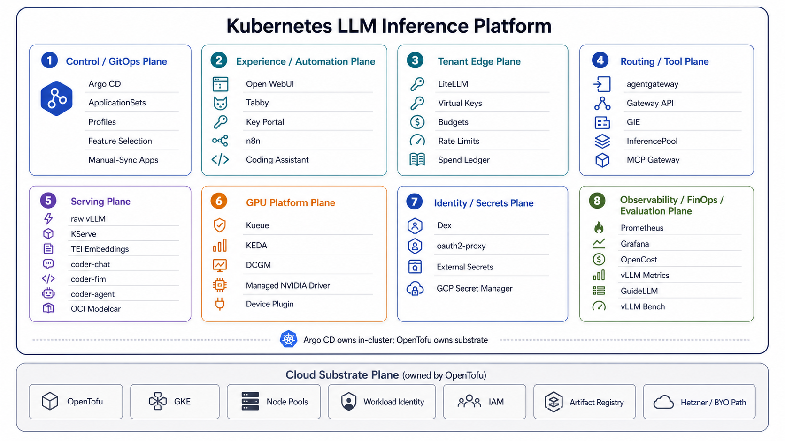
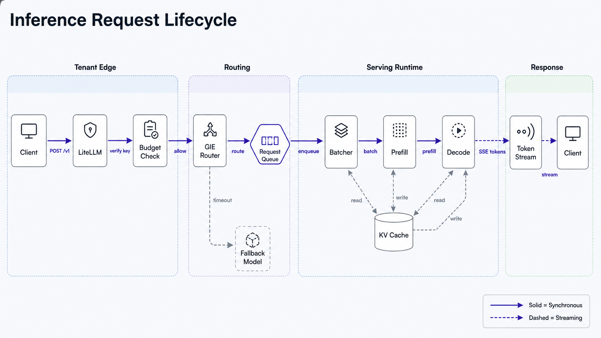

# k8s-llm-inference-platform

A GitOps-managed, GKE-first **LLM inference platform on Kubernetes**, with portable platform layers.
Argo CD reconciles the stack from committed manifests: fork it, render `config.yaml` into Git, and serve.

> An infrastructure repo, not a chatbot. The model is just a workload.

Full documentation (getting started, architecture, decisions, guides, benchmarks) is published at
[ai.wmx.dev](https://ai.wmx.dev); the source lives under [`docs/public`](docs/public).
This README is the map; the docs are the manual.

## What it is

A reference implementation of the LLM-serving platform layers on Kubernetes, each pinned, declarative,
and documented:

- **GPU platform**: provider-managed GPU drivers + device plugin, DCGM metrics, Kueue quota/admission,
  KEDA queue-depth autoscaling.
- **Serving**: vLLM (OpenAI-compatible) and KServe `InferenceService`, with OCI modelcar delivery.
- **Inference routing**: Gateway API + Inference Extension (GIE) for inference-aware `InferencePool` / EPP routing.
- **Tenant gateway**: LiteLLM (virtual keys, per-key budgets, spend ledger) and a governed MCP gateway
  (agentgateway: auth + rate-limit).
- **Experience**: Open WebUI and the Tabby coding assistant (chat / FIM / agentic), TEI embeddings.
- **Platform services**: External Secrets (ESO + Workload Identity), SSO (Dex + oauth2-proxy), Gateway
  API + cert-manager + external-dns, Prometheus / Grafana / DCGM observability, OpenCost allocation,
  Kyverno policy.

Portability is validated on more than one Kubernetes distribution; the platform layers carry no hard
cloud-provider dependency.

## Architecture and stack



The stack is split into cloud substrate and in-cluster platform layers. OpenTofu owns the substrate;
Argo CD owns everything inside Kubernetes.



The request path stays explicit: LiteLLM owns tenant economics, Gateway API + GIE owns routing, and
vLLM or KServe owns GPU serving.

## Request path

```
client (OpenAI-compatible)
  -> LiteLLM            tenant edge: virtual keys, budgets, spend     (ADR-0013)
  -> Gateway API + GIE  inference-aware routing: InferencePool / EPP  (ADR-0005)
  -> vLLM | KServe      OpenAI-compatible serving on GPU              (ADR-0006)
platform: GKE-managed GPU drivers + DCGM . Kueue quota (ADR-0002) . KEDA autoscaling (ADR-0014) . Argo CD GitOps
```

## Quickstart

For clearer step-by-step instructions, plus full provisioning and bring-up, see [getting started](https://ai.wmx.dev/getting-started).
`make help` lists every target.

## Selecting capabilities

Three orthogonal axes (ADR-0027, ADR-0031):

- **Profile** (staging): which *layers* deploy, `make root PROFILE=platform|serving|llm-gateway|full` (cumulative).
- **Features** (selection): which *capability groups* exist, edited in `config.yaml` `features:`, then
  `make render-config` and commit the generated files. Disabling a group prunes it after Argo syncs
  the committed change.
- **Bring-up**: each app's sync policy. GPU-costing serving workloads are manual-sync (created, not auto-deployed).

See [ADR-0031](docs/public/decisions/0031-config-driven-feature-selection.md) and
[`clusters/ai-dev/catalog/`](clusters/ai-dev/catalog).

## Repo layout

```
bootstrap/        Argo CD install (Helm, pinned); the GitOps entrypoint
clusters/ai-dev/  deployment-profile catalog for this cluster (ADR-0027, ADR-0031):
                    catalog/   child Applications grouped by capability group (selected via config.yaml features:)
                    appsets/   one per-layer ApplicationSet (platform|serving|routing|llm-gateway|experience|demos)
                    projects/  the `platform` AppProject (source/destination guardrail)
infra/            cluster prerequisites per provider (gke/, hetzner/); GPU pool, storage, DNS
environments/     per-env fork config (config.yaml: repoURL, projectID, domain, features)
platform/         external-secrets, observability, kueue, litellm, identity, cost (GPU drivers are provider-managed; ADR-0001)
serving/          raw-vllm, kserve
routing/          gateway-api-inference, mcp-gateway
experience/       open-webui + tabby (coding-assistant surfaces)
workloads/        gpu-smoke + kueue demos
benchmarks/       harness + recorded runs
docs/             public site content: architecture, decisions (ADRs), guides, benchmarks
```

## Roadmap

Future directions (LLM-level tracing, GPU time-slicing / fair-share, hard multi-tenant isolation,
RAG and MLOps lifecycle) are tracked but not committed: see the
[roadmap](docs/public/reference/roadmap.md). Decisions are recorded as ADRs under
[`docs/public/decisions`](docs/public/decisions); benchmark method and recorded runs
under [benchmarks](docs/public/benchmarks.md).
