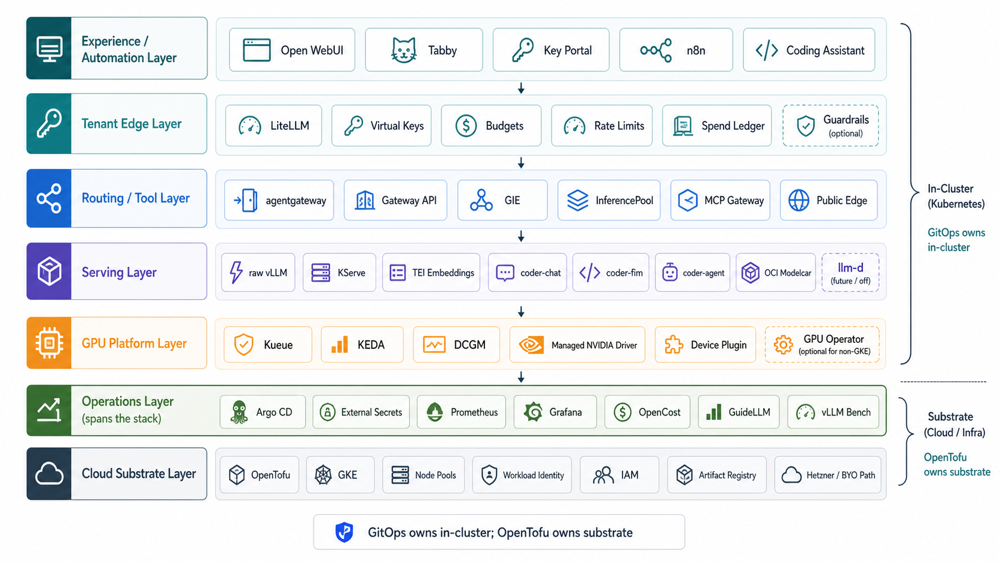
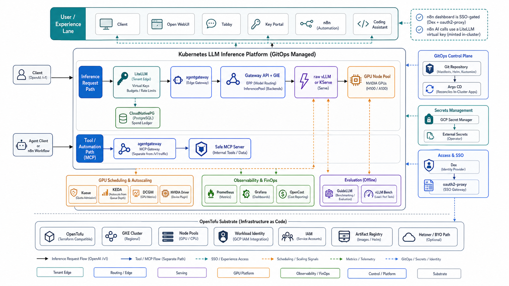
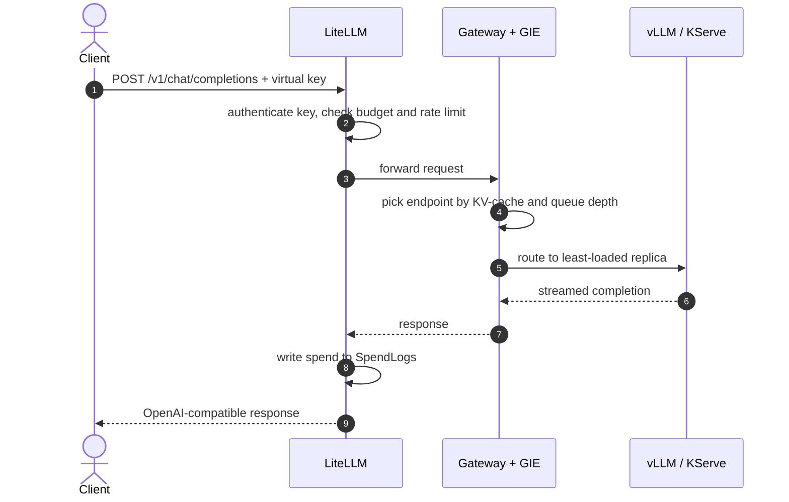

A layered LLM-serving platform on Kubernetes. The request path runs top to bottom; cross-cutting
concerns (GitOps, secrets, observability) span every layer.

## Goal and scope

Serve LLM inference on Kubernetes the way a platform team would. Every operational concern (GPU
scheduling, routing, tenancy, secrets, scaling, model delivery, observability) is an explicit,
forkable decision rather than a managed black box. The design target is a stack that runs the same
on any GPU-capable cluster and grows from a single scale-to-zero GPU to a multi-tenant,
HA deployment without rearchitecting. It integrates open-source components; it does not reinvent
them.

The one hard boundary: **infrastructure-as-code owns the cloud substrate; GitOps owns everything
inside Kubernetes.** Neither crosses into the other's half. That split keeps a fork portable
instead of a pile of provider-specific glue.

## The layers

- **Tenant edge: LiteLLM.** One OpenAI `/v1` facade with virtual keys, per-key/team budgets,
  rate limits, and a spend ledger. This is where tenancy economics live.
- **Routing: Gateway API + GIE.** Inference-aware endpoint selection (KV-cache, queue depth,
  model/canary splits) via an `InferencePool` and endpoint-picker, on agentgateway (no Istio).
  Distinct from the tenant edge: one is economics, the other is request routing.
- **Serving: vLLM / KServe.** Raw vLLM is the default (full control, minimal moving parts); KServe
  `InferenceService` adds managed lifecycle (canary, scale-to-zero, model governance) where it earns
  its control plane. See [Serving layers compared](/architecture/serving-layers).
- **GPU platform.** The NVIDIA driver, device plugin, and DCGM metrics (managed on GKE; the NVIDIA
  GPU Operator off GKE), with Kueue for quota/admission and KEDA for queue-depth autoscaling.
- **Substrate & delivery.** OpenTofu provisions the cluster and identity; Argo CD reconciles the
  whole in-cluster stack from git as an app-of-apps. Secrets sync keylessly via External Secrets
  Operator; observability is Prometheus + Grafana + DCGM + vLLM metrics.
- **Cost visibility.** OpenCost attributes real infrastructure cost (node, GPU, memory cost) per
  workload from the same Prometheus, feature-gated. It complements the LiteLLM spend ledger: token
  economics from the gateway, infrastructure cost from OpenCost.

For the canonical term-by-term glossary, see the [glossary](/reference/glossary).

## Platform topology

The full platform has more than one path through the cluster. `/v1` inference requests go through
LiteLLM and the inference router. MCP tool traffic is a separate route through agentgateway. n8n is
an experience-layer automation surface: its dashboard is SSO-gated, and its AI calls use a LiteLLM
virtual key rather than bypassing the tenant edge.

<Accordion title="Full topology diagram">

</Accordion>

## Request path

A single chat completion crosses the tenant edge, the router, and the model server. The edge owns
identity and economics; the router owns endpoint selection; the model server owns the GPU.

<Accordion title="Exact request sequence">

</Accordion>

## Components and status

Component versions and maturity. **Validated** means exercised end-to-end on GPU.

| Layer | Component | Version | State |
|---|---|---|---|
| Delivery | Argo CD (app-of-apps, sync waves) | v3.4 / chart 9.5.21 | ✅ Built |
| Substrate | OpenTofu (cluster, pools, identity, IAM) | n/a | ✅ Built |
| GPU platform | NVIDIA driver + device plugin + DCGM (managed on GKE / GPU Operator off-GKE) | n/a | ✅ Built |
| GPU platform | Kueue (ClusterQueue / LocalQueue / ResourceFlavor) | 0.18.1 | ✅ Built |
| GPU platform | KEDA (queue-depth autoscale) | n/a | ✅ Built |
| Serving | raw vLLM (OpenAI-compatible) | v0.23.0 | ✅ Validated |
| Serving | KServe `InferenceService` | v0.19.0 | ✅ Validated |
| Serving | OCI modelcar delivery (`oci://`, digest-pinned) | n/a | ✅ Validated |
| Routing | Gateway API + GIE (InferencePool + EPP) | agentgateway v1.2.1 / GIE v1.5.0 | ✅ Built |
| Tenant edge | LiteLLM (virtual keys, budgets, spend) | n/a | ✅ Built |
| Cost | OpenCost (per-workload infra cost, feature-gated) | chart 2.5.23 | ✅ Built |
| Experience | Coding assistant (chat / FIM / agentic, Open WebUI, Tabby) | Qwen2.5-Coder 1.5B-14B | ✅ Validated |
| Auth | SSO (Dex + oauth2-proxy + key-portal) | n/a | ✅ Validated |
| Observability | kube-prometheus-stack + DCGM + vLLM ServiceMonitor | 86.2.3 | ✅ Built |
| Secrets | External Secrets Operator + cloud secret manager (keyless) | ESO 2.6.0 | ✅ Built |
| Ingress | cert-manager | v1.20.2 | ✅ Built |

Deferred capabilities: LLM-level tracing (Langfuse), alerting, multi-GPU fair-share, GPU
time-slicing, RAG, and MLOps lifecycle. These are tracked with explicit adoption triggers, not
designed out.

## Operational model: IaC, GitOps, and the one-time steps

The platform is declarative end to end. After a one-time bootstrap, Argo CD reconciles the entire
in-cluster stack from git (platform, serving, routing, gateway, experience, and secrets via External
Secrets). Day-2 operation is 100% git: change a manifest, Argo applies it.

A short list of steps is imperative because they sit *below* GitOps (they create the cluster and the
GitOps engine) or handle values that cannot live in git:

| Step | Command | Why it is not reconciled from git |
|---|---|---|
| Cluster, IAM, registry, Workload Identity | `make tf-apply` | this *is* the IaC that creates the substrate |
| Install Argo CD | `make bootstrap` | installs the GitOps engine itself |
| Seed secrets | `make seed-secrets` | secret *values* are never committed |
| Private-repo credential | `make argocd-repo` | a fork's read token is supplied at setup |
| Apply the app-of-apps | `make root` | starts reconciliation; everything after is git |

The only capability that is genuinely outside infrastructure-as-code is **container image builds**: the
model-delivery image (an OCI modelcar with the weights baked in) is produced by a registry build, not a
declarative manifest. Pre-built public images are provided so a fork serves the default model with no
build step; building a different model is a documented, opt-in step.

## Go deeper

- **[Concepts](/architecture/lessons/index)**: the non-obvious decisions behind the platform.
- **[Serving layers compared](/architecture/serving-layers)**: raw vLLM vs KServe, same model and engine.
- **[Guides](/guides/vllm-serving)**: operate each layer.
- **[Get started](/getting-started/index)**: configure, provision, install.
