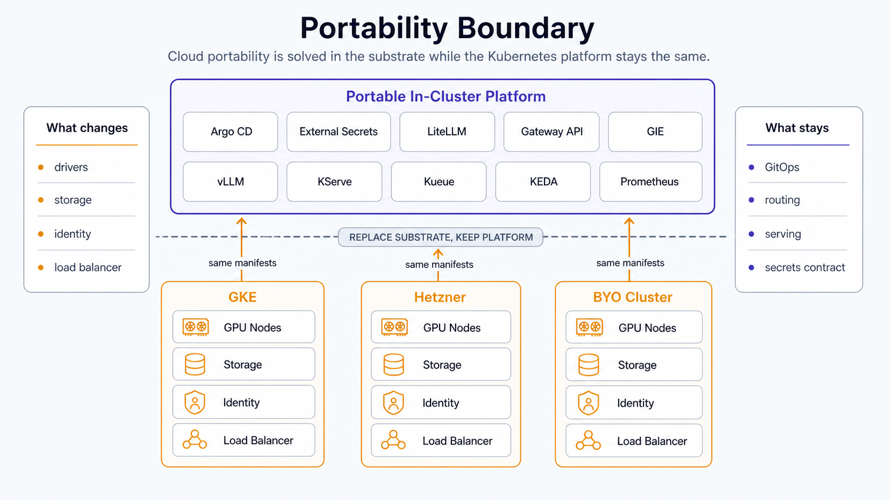

A platform that claims to be portable should prove it on a second cloud. The non-obvious part: almost the entire in-cluster stack moves unchanged. What changes is the substrate underneath: the GPU stack, storage classes, load balancing, and the secrets trust root. Proving portability means re-solving those, not rewriting the platform.

## Pick the cloud that gives you nothing managed

The sharpest thing to prove is the GPU substrate. On a managed cloud the NVIDIA driver, device-plugin, and DCGM are provided for you; portability means *you* install and run the NVIDIA GPU Operator (driver, device-plugin, GFD, DCGM, time-slicing) on self-installed Kubernetes. The second cloud should therefore be a forcing function: Hetzner dedicated GPU gives you no managed Kubernetes, no managed node pool, no managed driver, so you self-install with kubeadm and run the Operator yourself. That is exactly the muscle the proof exercises. A picked-managed second cloud would install the Operator for you and prove nothing.

The single load-bearing gotcha to be honest about: **GPU elasticity is effectively zero.** Dedicated GPUs are bare-metal, provisioning takes days, and the cluster autoscaler scales cloud VMs only, never bare-metal GPU nodes. So a scale-to-zero idle cost model is a managed-cloud artifact that does not hold; you pay 24/7 per box. The best achievable is scaling *workload pods* to zero on a pinned, always-paid node. Scope the proof to portability, not elastic GPU ops.

## Hetzner closeout

The 2026-06-25 Hetzner cycle validated the platform on a second substrate without changing the
in-cluster stack: k3s, hcloud storage and load balancing, GCP Secret Manager via External Secrets
Operator `sa-key`, private-repo Argo credentials, public TLS edge, LiteLLM's budgeted path, Open
WebUI, Tabby, and the NVIDIA GPU Operator all converged through GitOps. `make doctor PROFILE=full`
passed, and `make verify` returned 11 passed / 0 failed.

The GPU Operator path is now a real configuration path rather than a deferred note:
`gpu_stack: operator` creates the `nvidia-gpu-operator` app and installs a `ClusterPolicy` with the
driver, container toolkit, device plugin, DCGM exporter, and DCGM ServiceMonitor enabled. Prior
operator-run hardware validation covered GPU-node join and GPU runtime checks; this repo cycle
closed the GitOps and public-platform portability path.

## What actually changes off the managed cloud

Everything above the GPU and cloud-integration layer is already portable: cert-manager, KEDA, Kueue, vLLM, the gateway/router layer, CNPG, and the monitoring stack work as-is. The work concentrates in a few substrate concerns:

- **GPU stack.** Run the GPU Operator yourself, with precompiled driver containers and Secure Boot disabled: runtime kernel-module compilation is the top cause of stuck driver pods on Ada boxes. No MIG on Ada means time-slicing or MPS only: soft tenancy, no memory or fault isolation, so co-located models must jointly fit VRAM.
- **Storage.** Block-only RWO CSI with no RWX; shared weights need self-hosted NFS, Longhorn, or LINSTOR. This changes the model-delivery scale path, and the managed cold-start accelerators (Image Streaming, secondary boot disks) are gone; only the cloud-agnostic levers remain.
- **Load balancer.** A bare-metal CCM integration replaces the managed LB.

## Secrets: keep the interface, swap one file

External Secrets Operator stays the portable secrets interface; the backend is one swappable `ClusterSecretStore`. Off the home cloud, authenticate with keyless Workload Identity Federation rather than a static service-account key. WIF takes the irreducible long-lived-secret count from one to zero, since the only credential becomes a short-lived, cluster-minted token. The apiserver need not be public: publish only the static OIDC discovery and JWKS documents to a public URL and point the issuer at them.

The honest caveat: keeping one cloud's secret manager everywhere re-couples the secrets trust root to that cloud's IAM. That is a deliberate single-control-plane choice (fewer moving parts) but it undercuts a pure portability claim. The mitigation is to state the coupling explicitly and keep the `ClusterSecretStore` the one documented swap point, so a forker can repoint at Vault or a cloud-local manager and nothing else changes.
