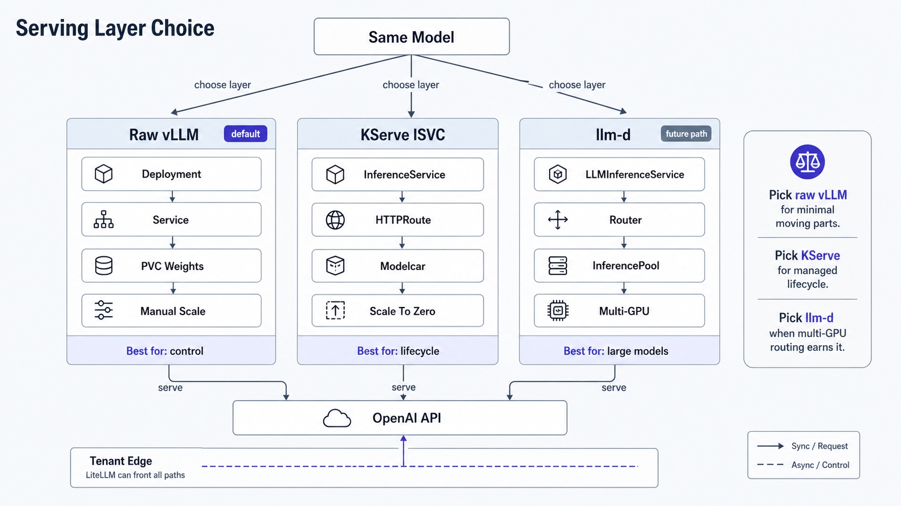

Both serve the **same** model (`Qwen2.5-0.5B-Instruct`) on the **same** engine (vLLM `v0.23.0`),
so this compares the *serving layer*, not the engine. raw vLLM is `serving/raw-vllm` (see
[Benchmarks](/benchmarks)); KServe is `serving/kserve`. Both expose the OpenAI API, and the
KServe path is fronted by the same agentgateway as the GIE routing layer. Operational gotchas: the
[KServe guide](/guides/kserve).

| Dimension | Raw vLLM (`serving/raw-vllm`) | KServe `InferenceService` (`serving/kserve`) |
|---|---|---|
| **What you write** | Deployment + Service + PVC + probes, by hand | One `InferenceService` CR; KServe reconciles the rest |
| **Model lifecycle** | Manual (`make vllm-up/down`, edit image/args) | Declarative; revisions tracked by the controller |
| **Rollout / canary** | DIY (Recreate; no traffic split) | `canaryTrafficPercent` (revision-based weighted split) |
| **Scale-to-zero** | Manual `replicas:0`; Argo `ignoreDifferences` | Native (`minReplicas:0`) |
| **Ingress / URL** | Service; you wire the gateway/route | KServe auto-creates an HTTPRoute + stable URL per ISVC |
| **Multi-model contract** | None; each model is bespoke | Uniform CR across all models (governance) |
| **Control / blast radius** | Total control, minimal moving parts | Controller + cert-manager + KServe's opinionated defaults |
| **Prereqs** | none beyond the cluster | cert-manager, KServe controller, a network controller |

## What KServe buys (and what it costs)

**Buys:** the *platform* owns model lifecycle: a stable per-model URL, declarative canary, native
scale-to-zero, and one CR contract across every model a team ships. That is the difference between
"I deployed a model" and "we operate a model-serving platform."

**Costs:** a control plane to run (cert-manager + controller) and a set of opinionated behaviours
that fight you until you know them: a default cpu limit of 1, the `model`+`runtime`
`/mnt/models` injection, an Istio VirtualService path unless disabled (all in the runbook). raw vLLM has
none of that surface because it does none of that work.

## When to use which

- **Raw vLLM**: one model, one team, full control, you own rollout/scale. The right call for a
  single benchmarked endpoint.
- **KServe `InferenceService`**: you want lifecycle/canary/scale/ingress/governance handled
  declaratively across many models.
- **`LLMInferenceService`**: a future path for large/multi-node models needing disaggregated
  serving and KV-aware routing (llm-d); it overlaps the GIE routing layer.

## Confirmed behavior

The same model answers an OpenAI `chat.completions` request on both layers. KServe path: the
`InferenceService` reaches `Ready`, `GET /v1/models` returns `qwen2.5-0.5b`, and
`POST /v1/chat/completions` returns 200 (`system_fingerprint vllm-0.23.0`) through the agentgateway,
identical to the raw vLLM endpoint. Weights load from a pre-staged volume rather than a live
Hugging Face pull, which is also the more air-gap-friendly pattern.
