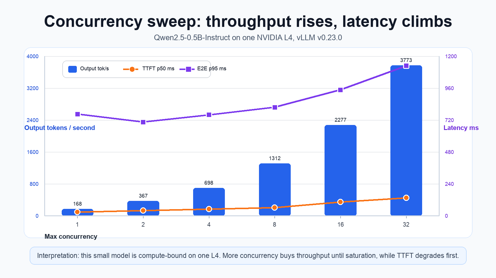

Baseline serving benchmark for `serving/raw-vllm`: a concurrency sweep measuring latency
(TTFT / ITL / end-to-end) and throughput, with GPU and KV-cache utilisation read from the
same Prometheus the dashboards use. Harness: `vllm bench serve` (the repo's `benchmarks/` Job).

## Run context

| | |
|---|---|
| Commit | `8e78aaa` |
| GPU | 1× NVIDIA L4 (23 GB), `g2-standard-4`, on-demand |
| Driver / CUDA | 580.126.20 / 13.0 (GKE-managed, COS) |
| Model | `Qwen/Qwen2.5-0.5B-Instruct` (BF16) |
| vLLM | `v0.23.0` (V1 engine) |
| Server args | `--gpu-memory-utilization 0.6 --max-model-len 8192` |
| Kubernetes | GKE `v1.36.0-gke.2684000` |
| Request shape | 256-token input / 128-token output, `--ignore-eos`, seed 42 |
| Load pattern | closed-loop (`--request-rate inf`) at fixed max-concurrency |

## Results: concurrency sweep

Latencies in **milliseconds**. TTFT = time to first token (prefill), ITL = inter-token
latency (decode), E2E = end-to-end request latency.

| concurrency | req/s | out tok/s | TTFT p50 | TTFT p95 | ITL p50 | ITL p95 | E2E p50 | E2E p95 |
|---|---|---|---|---|---|---|---|---|
| 1  | 1.3  | 168   | 27.0  | 115.5 | 5.1 | 6.1  | 679   | 765  |
| 2  | 2.9  | 367   | 37.8  | 48.2  | 5.2 | 6.3  | 698   | 705  |
| 4  | 5.4  | 698   | 50.1  | 85.4  | 5.3 | 6.4  | 722   | 760  |
| 8  | 10.2 | 1312  | 60.9  | 88.4  | 5.5 | 7.4  | 772   | 816  |
| 16 | 17.8 | 2277  | 103.8 | 135.7 | 6.0 | 8.9  | 880   | 947  |
| 32 | 29.5 | 3773  | 135.3 | 191.8 | 7.1 | 12.0 | 1082  | 1128 |

Resource peaks over the run (Prometheus / DCGM):

| | peak |
|---|---|
| GPU utilisation (`DCGM_FI_DEV_GPU_UTIL`) | **100 %** |
| GPU memory used (`DCGM_FI_DEV_FB_USED`) | ~13.9 GiB (the 0.6 reservation, not workload pressure) |
| KV-cache usage (`vllm:kv_cache_usage_perc`) | **1.1 %** |
| Requests running / waiting (`vllm:num_requests_*`) | 31 / **0** |

## What the numbers say

- **Compute-bound, not memory-bound.** GPU compute pins at 100 % under load while KV-cache
  never exceeds ~1 % and nothing ever queues (`waiting = 0`). For a 0.5B model the KV
  footprint per request is tiny, so on one L4 you run out of *compute* long before *memory*.
  Scaling pods/replicas wouldn't help on a single GPU: the GPU is already the bottleneck.
- **TTFT degrades first.** As concurrency rises 1 → 32, TTFT p50 grows ~5× (27 → 135 ms):
  more requests competing for prefill slots queue at the front of the request. This is the
  first SLI to watch under load.
- **Decode (ITL) stays cheap and flat.** ITL holds ~5-6 ms until concurrency 16, reaching
  12 ms p95 only at 32. Continuous batching keeps per-token decode efficient; the small
  model means decode is never the constraint here.
- **Throughput scales near-linearly to saturation.** Output throughput rises 168 → 3773
  tok/s (≈22×) from concurrency 1 → 32, tracking GPU utilisation toward 100 %. Past
  saturation, more concurrency buys throughput only by trading latency (TTFT/E2E climb).
- **E2E is decode-dominated.** End-to-end is ≈ TTFT + 127×ITL; with 128 output tokens the
  ~5-7 ms ITL accounts for most of the ~0.7-1.1 s total, so E2E tracks ITL more than TTFT.

These shapes are model- and GPU-specific: a larger model (bigger KV per token, heavier
prefill) would shift the first bottleneck toward KV-cache/memory and make TTFT far costlier.
The same harness re-run on that model is the next data point.

## Live view

The **vLLM Serving** Grafana dashboard (`dashboards/vllm-serving-dashboard.json`) shows the
same signals in real time: TTFT/ITL/E2E percentiles, prompt vs generation throughput,
running vs waiting requests, KV-cache usage, and GPU util/mem (DCGM).
