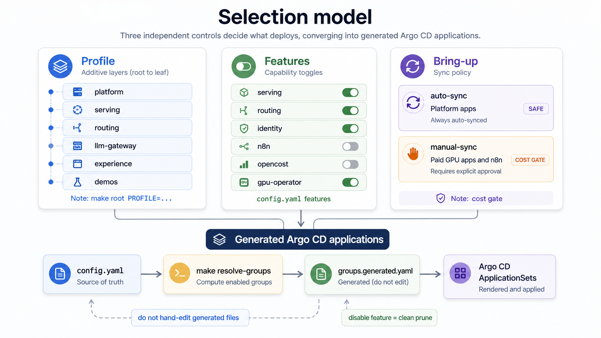

Argo CD reconciles the cluster **from a git repo**, so the first step is to fork this repo and set
your fork's non-secret values in one place. This stage is cloud-independent: you do it the same way
whether you target GKE, Hetzner, or your own cluster.

## Fork the repo

```sh
gh repo fork ahmedwaleedmalik/k8s-llm-inference-platform --clone
cd k8s-llm-inference-platform
```

You can keep the fork private; the platform installs a read-only Argo CD repo credential for private
forks ([Install the platform](/getting-started/install-platform)).

## Set your fork config

`environments/<env>/config.yaml` is the **single source of fork config**, the one place you set
non-secret, per-environment values. Secret *values* never live here; they come from your cloud's
secret manager.

```yaml
cluster:
  name: ai-dev
  projectID: <your-cloud-project-id>     # GKE project; ignored off-GCP
  location: us-central1-a
repoURL: https://github.com/<you>/k8s-llm-inference-platform.git
domain: ""                               # empty = no public ingress
features:                                # capability toggles (see below)
  kserve: true
  identity: true
  experience: true
  # ...
```

`config.yaml` is the single source for `repoURL` and `projectID`. Rather than templating, a script
rewrites every file that embeds them (the app-of-apps, all Argo `Application`s, the secret-store
config, scripts, READMEs):

```sh
make fork-init        # propagate repoURL + projectID + domain, then resolve every *.generated.yaml from config
make config-check     # catch config.yaml / tfvars drift before any sync
git diff --stat       # review what changed
```

`make fork-init` rewrites only git-tracked files (it uses `git grep`), so if you copied the repo
instead of `gh repo fork`, commit first (`git add -A && git commit`) or it exits with an error.

Never hand-edit the embedding files; edit `config.yaml` and re-run `make fork-init`. Editing only
`config.yaml` matters: `make fork-init` discovers the old value from a canonical anchor manifest, so if
you hand-edit the domain, `repoURL`, or `projectID` in some manifests but not others first, the tree is
inconsistent and `make fork-init` aborts with a message naming the disagreeing files. Run `git checkout`
on those files, then re-run. After `make fork-init` completes you are free to customize per-component
hostnames (for example a separate domain for `grafana` or `chat`); the guard only checks the pre-fork
template state and never enforces uniformity afterward.

## Secrets and providers

Secret *values* never live in git. The platform splits them into two classes: internal randoms it can
mint for you, and real external credentials only you can provide. For the full per-secret list, see
the [Secrets reference](/reference/secrets).


### Secrets you provide vs auto-generated

This stage is where you **decide** the split; you seed the values later, in
[Provision](/getting-started/provision-infra), once the backend exists. `make seed-secrets` mints
every **internal random** secret (LiteLLM master/salt keys, the internal vLLM key, the oauth2-proxy
cookie secret, the Dex static-admin password/hash, the Dex OIDC client secrets, and the Postgres
passwords), create-if-absent and reusing existing values. You supply only the **real external**
credentials, and only the ones your configuration actually uses:

| Secret | Class | When you need it |
|---|---|---|
| `litellm-master-key`, `litellm-salt-key`, `vllm-api-key` | auto-generated | always (seeded) |
| `oauth2-proxy-cookie-secret`, `dex-admin-password`, `dex-admin-hash`, `dex-*-client-secret` (×6) | auto-generated | always (seeded) |
| `litellm-db-password`, `litellm-grafana-ro-password` | auto-generated | always (seeded) |
| `n8n-encryption-key` | auto-generated | n8n enabled |
| `cloudflare-api-token` | you provide | only if `dns.automate` with `dns.provider: cloudflare` |
| `anthropic-api-key` | you provide | only if using the Anthropic egress provider |
| `hf-token` | you provide | only for gated Hugging Face models |

Seeding writes to your secret backend, so it is a **substrate** step, not a cloud-independent one. You
run `make seed-secrets` in [Provision](/getting-started/provision-infra), and `make credentials`
(operator logins) later in [Install](/getting-started/install-platform), after Argo CD is up. After
seeding, a typical fork has **zero to three** secrets left to hand-create. If an older fork has
`dex-admin-hash` but no `dex-admin-password`, run `make reset-dex-admin` once; bcrypt hashes are
one-way, so the original password cannot be recovered.

### Secret backend (your choice)

The default backend is **Google Secret Manager** (`secret_backend: gcpsm`). To use **AWS Secrets
Manager**, **Azure Key Vault**, **HashiCorp Vault**, or **Kubernetes** Secrets, set `secret_backend`
to any non-`gcpsm` value and fill the store's `provider:` block per the
[ESO provider docs](https://external-secrets.io/latest/provider/):

```sh
# config.yaml: secret_backend: vault   (anything but gcpsm)
make resolve-secret-store     # renders a PLACEHOLDER store, then leaves it for you to fill
```

Every `ExternalSecret` references the store by name (`secret-store`), so swapping backends changes
**only the store**, not the workloads. For `gcpsm`, the store is rendered fully from config; for any
other backend, the resolver writes a placeholder once and never clobbers your hand-edited provider
block. One exception: the ESO Kubernetes provider needs a per-`ExternalSecret` `property:` field, so
those manifests do change (see [Secrets](/reference/secrets)).

### GPU stack (your substrate)

`gpu_stack` selects who installs the NVIDIA driver, device plugin, and DCGM metrics exporter:

- `gke-managed` (default): GKE's node image provides the stack; DCGM metrics come from GKE's
  managed `dcgm-exporter`. No operator is deployed.
- `operator`: for any non-GKE substrate (Hetzner, bare metal, Vast). The platform deploys the
  **NVIDIA GPU Operator** (driver + toolkit + device plugin + DCGM + node-feature-discovery) as a
  GitOps-managed app, and DCGM metrics come from the operator's own exporter. You still supply the
  node prerequisites (matching kernel headers; Secure Boot off on Ada GPUs).
- `none`: CPU-only clusters; no GPU stack and no GPU metrics.

```sh
# config.yaml: gpu_stack: operator
make resolve-groups     # toggles the gpu-operator group + renders the DCGM scrape target
```

Do not set `operator` on GKE: the operator's `nvidia` container runtime cannot register with GKE's
containerd. `make doctor` warns on the mismatch. See [provision infrastructure](/getting-started/provision-infra)
for the off-GKE GPU path.

### DNS provider (if `dns.automate`)

When `dns.automate: true`, set `dns.provider` (`none`, `google`, or `cloudflare`). `cloudflare`
requires the `cloudflare-api-token` external secret, a token scoped `Zone:DNS:Edit` minted per the
[Cloudflare API token docs](https://developers.cloudflare.com/fundamentals/api/get-started/create-token/);
`google` is keyless on GKE via Workload Identity; `none` means you create A records by hand. See the
[external-dns docs](https://kubernetes-sigs.github.io/external-dns/latest/). On the `cloudflare` path,
cert-manager issues wildcard certificates with an ACME DNS-01 solver using the same token; see the
[cert-manager DNS-01 docs](https://cert-manager.io/docs/configuration/acme/dns01/).

### SSO / Dex

The `identity` feature ships **Dex with a static demo user** for first-boot access. To wire a real
identity provider (Google, GitHub, generic OIDC, LDAP), add a
[Dex connector](https://dexidp.io/docs/connectors/). The OIDC client secrets Dex needs
(`dex-*-client-secret`) and static-admin bootstrap keys are auto-seeded by `make seed-secrets`, so you
only configure the connector.

## Choose how much platform to deploy

Two independent dials control what gets installed.



**Profiles** are cumulative layers, applied with `make root PROFILE=…`. Each is a superset of the
one before: you widen, you don't switch:

| `PROFILE` | Adds |
|---|---|
| `platform` | GitOps base: GPU platform, scheduling/quota, observability, secrets |
| `serving` | raw vLLM / KServe serving |
| `llm-gateway` | inference-aware routing + the LiteLLM tenant gateway |
| `full` | example tenants and demos |

> **`PROFILE` is not `profile:`.** The `make` variable `PROFILE` selects deploy *layers* (this table).
> The separate `profile:` key in `config.yaml` selects the economic *HA tier* (`cost` / `dev` / `prod`),
> covered in [Production HA](/guides/prod-ha-validation). Two dials, similar names.

**Feature flags** (`config.yaml` `features:`) toggle individual capability groups *within* a layer,
e.g. run your own DNS instead of the bundled one. After editing flags, regenerate the resolved set:

```sh
make resolve-groups   # regenerate every *.generated.yaml from config (chains profile/secret-store/gpu/guardrails + groups)
```

Commit and push your config to the fork. Argo CD reads from git, not your working tree:

```sh
git commit -am "config: point platform at my fork"
git push
```

Next: **[Provision infrastructure](/getting-started/provision-infra)** for your target cloud.

For the full target list, see [Make targets](/reference/make-targets).
