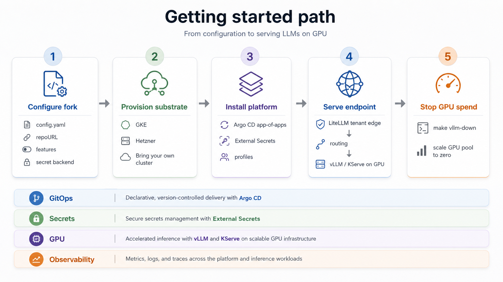

This platform installs in three stages, and the order matters because the boundary between them is
deliberate: **the platform is cloud-independent; only the substrate underneath it is not.**

<Steps>
  <Step title="Configure">
    Fork the repo and set non-secret values in one `config.yaml`. This step is cloud-independent.
  </Step>
  <Step title="Provision infrastructure">
    Stand up a Kubernetes cluster with GPU nodes. This is the cloud-specific step: pick GKE, Hetzner,
    or bring your own cluster.
  </Step>
  <Step title="Install the platform">
    Argo CD reconciles the whole stack from your fork onto whatever cluster you provisioned. This
    step is identical across clouds.
  </Step>
</Steps>

## Why the split

The substrate (cluster, node pools, identity, IAM, GPU drivers) is the part that changes between
providers. The in-cluster stack (GitOps delivery, serving, routing, tenancy, observability) does
not. Keeping infrastructure provisioning separate from platform installation is what makes the
platform portable: to move clouds you re-solve the substrate, not the platform.

The one substrate detail that leaks into the platform is the **GPU stack**. On GKE the managed node
image ships the NVIDIA driver, device plugin, and DCGM. Off GKE you run the **NVIDIA GPU Operator**
yourself to provide the same three things. The serving layer above it is unchanged. This is called
out where it matters in [Provision infrastructure](/getting-started/provision-infra) and
[Install the platform](/getting-started/install-platform).

## What you end up with

A working, **authenticated, OpenAI-compatible** vLLM endpoint serving
`Qwen/Qwen2.5-0.5B-Instruct` on a GPU, with Argo CD reconciling the stack from your fork, and
secrets materialized keylessly from your cloud's secret manager. The GPU is **scale-to-zero**, so
the expensive part costs nothing when idle.

> **Cost (GKE reference).** Idle baseline is ~$30-35/mo (the always-on control-plane node pool).
> The GPU node is scale-to-zero ($0 until a GPU pod schedules) and an L4 runs at roughly
> $0.70/hr on-demand. **Never leave a GPU running**; the teardown step in
> [Install the platform](/getting-started/install-platform) scales it back to zero in one command.
