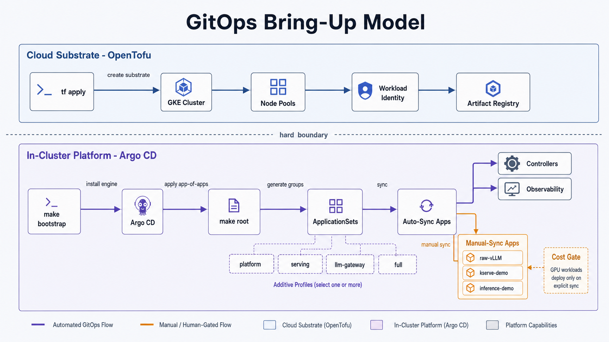

With a cluster provisioned ([step 2](/getting-started/provision-infra)) and your fork configured
([step 1](/getting-started/configure)), this stage installs the platform itself: Argo CD reconciles the whole
stack from your fork. **It is identical across clouds**: the commands below assume only a reachable
cluster (pointed at by the dedicated kubeconfig below) and the four substrate capabilities from step 2
(GPU stack, secret backend, storage class, optional ingress).

> **GPU stack reminder.** On GKE the driver, device plugin, and DCGM are already present. Off GKE,
> make sure the **NVIDIA GPU Operator** is installed before you bring serving up, or GPU pods will
> stay `Pending`.

## Point this repo at your cluster

This repo talks only to its own kubeconfig file (`./kubeconfig`, gitignored), never your global
`~/.kube/config` or current context. The isolation is deliberate: a context switch or a kubeconfig
overwrite in another terminal cannot silently redirect a deploy. Every cluster command prints the
resolved target and refuses to run if the file is missing or the cluster is unreachable. Override the
path with `CLUSTER_KUBECONFIG=/some/path` if you keep it elsewhere.

Generate it once, pointed at the cluster you provisioned:

- **GKE**: the `get-credentials` command for your fork comes from Terraform output. Write it to the
  dedicated file:

  ```sh
  KUBECONFIG=$PWD/kubeconfig $(make -s tf-credentials)
  ```

- **Hetzner / bring your own cluster**: copy your kubeconfig into place (or point `CLUSTER_KUBECONFIG`
  at it):

  ```sh
  cp /path/to/kubeconfig ./kubeconfig
  ```

Confirm the target before installing anything:

```sh
make require-kube      # prints kubeconfig + context + server, or fails with guidance
```

The `make` targets resolve `./kubeconfig` for you. For the manual `kubectl` commands in this guide,
point your shell at the same file so they reach this cluster and not your global context:

```sh
export KUBECONFIG=$PWD/kubeconfig
```

## Confirm secrets are seeded

The platform never stores secret values in git. External Secrets Operator (ESO) materializes
Kubernetes Secrets from your secret backend; git holds only the *contract* (which secrets exist). You
seeded the values in [Provision](/getting-started/provision-infra) with `make seed-secrets`, so they
already exist; ESO syncs them as the platform comes up.

If you took the **bring-your-own-cluster** path and skipped that step, seed now: `make seed-secrets`
for a `gcpsm` backend, or create the keys in your own backend (the command prints the list). On a
non-`gcpsm` backend you also need the `secret-store` provider block filled in, which is a
[Configure](/getting-started/configure) step (`make seed-secrets` writes values, it does not configure
the store). Until a value exists, its ExternalSecret stays `SecretSyncError` and the dependent pod
won't start, by design.

> The tutorial model `Qwen/Qwen2.5-0.5B-Instruct` is **ungated**, so no Hugging Face token is
> needed. A `hf-token` secret is only required for the optional KServe demo with a gated model.

See the [secret contract guide](/guides/secret-contract) for the full list and ownership, and the
[Secrets reference](/reference/secrets) for the per-secret backend keys and the no-hosted-store path
(the ESO Kubernetes provider, with a worked example).

## Bootstrap Argo CD

Argo CD is the GitOps entrypoint: install it once, then it reconciles everything from your fork:

```sh
make bootstrap        # installs Argo CD (pinned chart)
```

If your fork is **private**, give Argo CD a read-only repo credential (skip for a public fork). Use
a fine-grained GitHub PAT with **Contents: Read-only**:

```sh
export ARGOCD_REPO_PAT=<fine-grained-PAT-contents-read-only>
export ARGOCD_REPO_USERNAME=<your-github-username>
make argocd-repo
```

Collate your operator logins (Argo CD, the Dex static-admin password, Grafana) into the gitignored
`secrets/credentials.local.md`:

```sh
make credentials      # reads the live cluster + backend; SSO via Dex is the real path
```

## Apply the app-of-apps

`make root PROFILE=<p>` applies the AppProject plus the per-layer ApplicationSets for that profile;
Argo CD then reconciles every app from your **pushed** fork (the ApplicationSets read
`targetRevision: main`, not your working tree). `make wait PROFILE=<p>` blocks until that profile's
auto-sync apps report Synced + Healthy. Profiles are cumulative supersets, so a higher one includes
everything below it.



Minimal path: one `root` and one `wait` at your target profile (the two must match). Paid workloads
stay dormant at any profile because they are manual-sync (see [staged bring-up](/guides/staged-bring-up)),
so `full` is safe:

```sh
make root PROFILE=full          # platform + serving + routing + llm-gateway + experience + demos
make wait PROFILE=full
```

`make root` refuses to run if `groups.generated.yaml` is missing. If you changed `config.yaml` since
`make fork-init`, re-run `make resolve-groups`, then **commit and push** before `make root` (Argo reads
git, not your working tree).

For a first bring-up, applying one layer at a time makes a broken layer obvious before you widen. Each
profile is a superset, so you re-run `root` at each step:

```sh
make root PROFILE=platform     && make wait PROFILE=platform     # GitOps base
make root PROFILE=serving      && make wait PROFILE=serving      # + raw vLLM + KServe
make root PROFILE=llm-gateway  && make wait PROFILE=llm-gateway  # + routing + LiteLLM
make root PROFILE=full         && make wait PROFILE=full         # + experience + demos
```

The `experience` layer (Open WebUI, Tabby, key-portal, and n8n when enabled by feature flag) needs
deploy-time secrets that can live in neither git nor Secret Manager because they depend on the
running proxy: each app's LiteLLM virtual key is minted against the live LiteLLM, so its traffic is
keyed and budgeted. Open WebUI also gets a random `WEBUI_SECRET_KEY` session signer. The in-cluster
`litellm-keys` Job mints these automatically once LiteLLM is reachable, so Open WebUI and Tabby
auto-sync with no manual step. n8n is a separate manual-sync app and uses its own key-minter Job. The
Jobs are idempotent: they keep a still-valid key and re-mint only when one is missing. To re-mint
Open WebUI's secret by hand (for example after rotating the master key), run
`make seed-experience`.

Each ApplicationSet creates one app-of-apps per enabled capability group. To disable a group, flip
its bool in `config.yaml` and re-run `make resolve-groups` (the prune cascades). To remove a whole
layer, `kubectl delete -f clusters/<env>/appsets/<layer>.yaml`.

Per-profile validation:

| Profile | Apply | Wait | Smoke |
|---|---|---|---|
| `platform` | `make root PROFILE=platform` | `make wait PROFILE=platform` | `make doctor PROFILE=platform` |
| `serving` | `make root PROFILE=serving` | `make wait PROFILE=serving` | `make vllm-up && make smoke PROFILE=serving && make vllm-down` |
| `llm-gateway` | `make root PROFILE=llm-gateway` | `make wait PROFILE=llm-gateway` | `make doctor PROFILE=llm-gateway`, then the LiteLLM call in the [LiteLLM guide](/guides/litellm) |
| `full` | `make root PROFILE=full` | `make wait PROFILE=full` | `make vllm-up && make smoke PROFILE=full && make vllm-down` |

Watch reconciliation in the UI:

```sh
make argocd-ui        # → http://localhost:8080
```

The shipped Argo CD config is SSO-only (`admin.enabled: "false"`), so fresh installs do not create
an initial admin password. After the identity and public-edge apps sync, sign in through Dex at
`https://argocd.<your-domain>`. Break-glass access is documented in
`bootstrap/argo-cd/values.yaml`.

## Staged bring-up: the cost gate

The repo splits Argo apps by **sync policy** so a fresh `make root` never spins up paid compute:
**platform/infra apps auto-sync; serving workloads are manual**. Full detail in the
[staged bring-up guide](/guides/staged-bring-up).

First confirm the platform is healthy and ESO actually synced your secret (the keyless secret chain
working).

```sh
make wait PROFILE=platform
kubectl -n serving get externalsecret vllm-api-key    # STATUS should reach SecretSynced
```

If it shows `SecretSyncError`, run `make doctor PROFILE=serving` to find the missing secret value or
identity issue.

Then bring serving up. `raw-vllm` is a **manual-sync** app shipping at `replicas: 0`, so syncing
alone is still $0; `make vllm-up` is what provisions the GPU node:

```sh
argocd app sync raw-vllm     # deploys at replicas:0 (no GPU node yet)
make vllm-up                 # scale to 1 → GPU node provisions → model loads (costs while running)
make vllm-smoke              # authenticated /v1/chat/completions → expect HTTP 200
```

`make vllm-up` waits on the rollout (up to 15m). First boot is slow: GPU node provisioning + model
pull + CUDA-graph capture. A warm node reuses the model-cache PVC. Optionally benchmark with
`make bench` (see [Benchmarks](/benchmarks)).

## What success looks like

`make vllm-smoke` ends with a non-empty completion:

```
SMOKE PASSED: model replied: pong
```

You now have, end-to-end:

- **GitOps**: Argo CD reconciling your fork (platform apps Healthy).
- **Keyless secrets**: ESO → your secret manager (`vllm-api-key` Synced).
- **Authenticated serving**: vLLM rejecting unauthenticated calls and answering authenticated
  `/v1/chat/completions` with HTTP 200.

To reach the endpoint yourself:

```sh
kubectl -n serving port-forward svc/raw-vllm 8000:8000 &
KEY=$(kubectl -n serving get secret vllm-api-key -o jsonpath='{.data.api-key}' | base64 -d)
curl -s http://localhost:8000/v1/chat/completions \
  -H "Authorization: Bearer $KEY" -H 'Content-Type: application/json' \
  -d '{"model":"qwen2.5-0.5b-instruct","messages":[{"role":"user","content":"hello"}],"max_tokens":32}'
```

## Tear down: stop paying

**The single most important command** releases the GPU node and drops GPU spend to $0:

```sh
make vllm-down              # scale raw-vllm to 0 → GPU node released ($0 idle)
```

That stops the expensive part. To go all the way to $0, delete the cluster; follow the
[teardown guide](/guides/teardown) for the ordered teardown (GPU pool → apps → cluster →
leftover cloud resources) with the orphaned-resource cost footguns called out.

## Where to go next

- [Staged bring-up guide](/guides/staged-bring-up): the day-to-day bring-up / cost gate.
- [Serving layers compared](/architecture/serving-layers): raw vLLM vs KServe.
- [KServe guide](/guides/kserve): the optional managed-lifecycle serving path.
