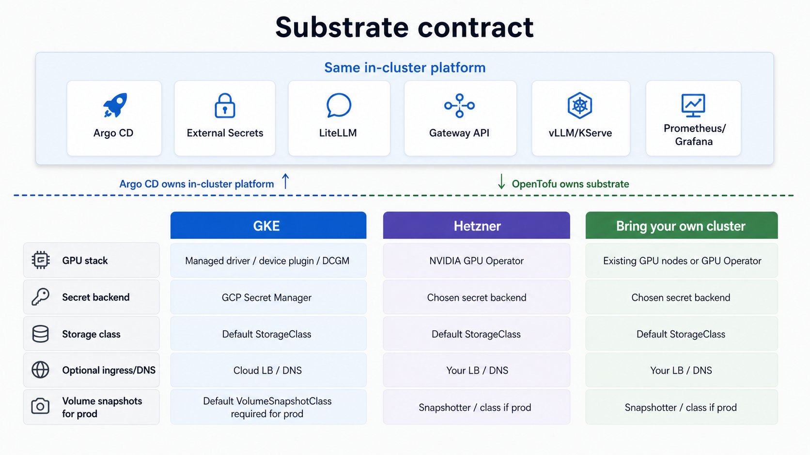

The platform needs a Kubernetes cluster with **GPU nodes**. This is the only cloud-specific stage.
Provisioning the substrate (cluster, node pools, identity, IAM) is owned by infrastructure-as-code
(OpenTofu); the platform layer on top is identical regardless of which path you take here.

Pick one:

- [GKE](#gke): fully supported, the reference substrate.
- [Hetzner](#hetzner): supported second cloud (self-managed GPU stack).
- [Bring your own cluster](#bring-your-own-cluster): you already have a GPU cluster.

## What the platform expects from any substrate

Whichever path you take, the platform assumes the substrate provides the same capabilities. On GKE
most are managed; off GKE you provide or select them yourself.



| Capability | GKE | Off GKE |
|---|---|---|
| **GPU stack** (driver, device plugin, DCGM metrics) | Managed by the GKE node image (`gpu_stack: gke-managed`) | Set `gpu_stack: operator` and the platform deploys the **NVIDIA GPU Operator** for you (driver + device plugin + DCGM + NFD), GitOps-managed. The node prerequisites (kernel headers, Secure Boot off on Ada) are still yours |
| **Secret manager** (keyless secret sync) | GCP Secret Manager via Workload Identity | Your provider's secret backend, or a self-hosted one, behind External Secrets Operator |
| **Storage class** (all PVCs, incl. CNPG) | GKE default | One `StorageClass` marked default; every PVC inherits it. ReadOnlyMany only if you want shared model caches |
| **Volume snapshots** (`prod` profile CNPG backups only) | PD CSI driver is managed, but GKE ships **no default `VolumeSnapshotClass`**; create one for `prod` (see below) | CSI external-snapshotter installed plus one `VolumeSnapshotClass` marked default; CNPG inherits it |
| **Ingress / DNS** (only if exposing publicly) | Cloud LB + DNS | Your LB + DNS provider |

The serving, routing, and tenancy layers above this do not change. Provisioning differs; the
platform does not.

## GKE

The OpenTofu root creates the cluster, a CPU pool, a scale-to-zero GPU pool, Workload Identity, node
IAM, required APIs, and an Artifact Registry repo for model images.

### Prerequisites

Local tools: GNU `make`, `gcloud` (authenticated, with the `gke-gcloud-auth-plugin` component so
`kubectl` can authenticate to GKE), `tofu` (OpenTofu), `kubectl`, `helm` v3, plus
`git`, `curl`, `jq`, `openssl`, `perl`, and `python3` with `pyyaml`. macOS and Linux are both
supported (`make fork-init` uses `perl`, not `sed -i`, and the resolver scripts use only POSIX `awk`).

GCP:

- A **GCP project** with **billing enabled**.
- **GPU quota** in your region. The default GPU pool is L4 in `us-central1-a`; you need
  `NVIDIA_L4_GPUS` (regional) ≥ 1, `GPUS_ALL_REGIONS` (global) ≥ 1, and regional `CPUs` headroom.
  Request increases **before** you start; approval can take hours. See the
  [GPU debugging guide](/guides/gpu-debugging).

> L4 is frequently stocked out in `us-central1-a`. The platform is GPU-type-agnostic; a T4 fallback
> is supported by changing `gpu_node_pool_name`, `gpu_machine_type`, and `gpu_accelerator_type` in
> `infra/gke/terraform/terraform.tfvars`.

### Enable bootstrap APIs

A blank project needs Service Usage and Resource Manager enabled first so OpenTofu can manage the
rest:

```sh
export PROJECT=<your-gcp-project-id>
gcloud config set project "$PROJECT"
gcloud services enable serviceusage.googleapis.com cloudresourcemanager.googleapis.com \
  --project "$PROJECT"
```

### Create the cluster

```sh
cp infra/gke/terraform/terraform.tfvars.example infra/gke/terraform/terraform.tfvars
$EDITOR infra/gke/terraform/terraform.tfvars     # optional node overrides
make tf-init
make tf-plan
make tf-apply                                     # creates paid resources
KUBECONFIG=$PWD/kubeconfig $(make -s tf-credentials)     # write the dedicated ./kubeconfig
make require-kube                                  # print + validate the target
```

`make tf-apply` prompts for interactive approval. For unattended/CI applies, set `AUTO_APPROVE=1`
to pass `-auto-approve`:

```sh
make tf-apply AUTO_APPROVE=1                       # non-interactive (CI)
```

### Seed secrets into the backend

`tf-apply` enabled the Secret Manager API (`infra/gke/terraform/main.tf`), so the backend is now
reachable. Seed the internal random secrets and create the external ones your config uses:

```sh
make seed-secrets     # mint internal randoms (create-if-absent); prints the external ones to add
```

Seeding is **substrate-specific**, and that is the point: on GKE `make seed-secrets` writes to Google
Secret Manager via `gcloud`. For any other backend it prints the key list plus the
[ESO provider docs](https://external-secrets.io/latest/provider/) link, and you create the values with
that backend's own tooling (`vault kv put`, `aws secretsmanager create-secret`, `kubectl`). The
in-cluster contract is identical either way: every workload reads a Kubernetes Secret that ESO
materializes from the `secret-store`. See the [Secrets reference](/reference/secrets) for the list.

### Verify the GPU pool is scale-to-zero

GKE installs the NVIDIA driver and device plugin; the pool runs **0 nodes until a GPU pod
schedules**, so it costs ~$0 by itself.

```sh
gcloud container node-pools describe gpu-l4 \
  --cluster=ai-dev --location=us-central1-a --project="$PROJECT" \
  --format='value(autoscaling.enabled,autoscaling.minNodeCount,autoscaling.maxNodeCount)'
```

Expected: enabled, min `0`, max `1`. Now continue to
**[Install the platform](/getting-started/install-platform)**.

### Prod profile: create a default VolumeSnapshotClass

The `prod` profile schedules CNPG volume-snapshot backups, which need a **default
`VolumeSnapshotClass`**. GKE installs the PD CSI driver and the snapshot CRDs but ships no default
class, so create one before applying the `prod` profile. `make doctor PROFILE=full` fails until it
exists:

```sh
kubectl apply -f - <<'EOF'
apiVersion: snapshot.storage.k8s.io/v1
kind: VolumeSnapshotClass
metadata:
  name: gke-pd-snapshotclass
  annotations:
    snapshot.storage.kubernetes.io/is-default-class: "true"
driver: pd.csi.storage.gke.io
deletionPolicy: Delete
EOF
```

The `cost` and `dev` profiles take no backups and need no snapshot class.

## Hetzner

<Note>
Hetzner is the platform's **portability proof**: the same in-cluster stack on a second cloud, with
a self-managed GPU stack (NVIDIA GPU Operator) instead of GKE's managed one. GKE is the reference
substrate; the self-managed GPU stack is validated on Hetzner. This section documents the path and
the substrate knobs it uses.
</Note>

On Hetzner you provision the substrate yourself (cluster + GPU nodes), then run the four
substrate capabilities the platform expects:

- **GPU stack**: set `gpu_stack: operator` in `config.yaml` and the platform deploys the **NVIDIA
  GPU Operator** (driver, device plugin, DCGM, NFD) as a GitOps-managed app. This replaces what GKE's
  node image provides for free, and is the single biggest difference from the GKE path. You still
  supply the node prerequisites (matching kernel headers; Secure Boot off on Ada GPUs).
- **Secret manager**: point External Secrets Operator at your chosen backend instead of GCP Secret
  Manager + Workload Identity.
- **Storage class**: provide a default `StorageClass` for the model-cache volume.
- **DNS / ingress**: only if you expose the endpoint publicly.

Once the cluster has GPU nodes and those four capabilities, the platform installs **unchanged**;
skip to [Install the platform](/getting-started/install-platform). See the
[portability concepts](/architecture/lessons/portability) for why these four, and nothing else,
are what changes between clouds.

## Bring your own cluster

If you already run a Kubernetes cluster with GPU nodes, skip provisioning entirely. Confirm it
provides:

- **GPU nodes** with `nvidia.com/gpu` resources schedulable. Either bring your own driver + device
  plugin + DCGM, or set `gpu_stack: operator` and let the platform deploy the **NVIDIA GPU Operator**
  (it expects matching kernel headers and Secure Boot off on Ada GPUs).
- A default **`StorageClass`** for the model-cache PVC.
- **External Secrets Operator** wired to a secret backend you control (or be ready to install it as
  part of the platform layer), so secrets sync keylessly rather than living in git.
- A kubeconfig for the cluster. This repo talks only to its own `./kubeconfig` (gitignored), never
  your global current context; copy yours to `./kubeconfig` or point `CLUSTER_KUBECONFIG` at it. The
  install stage validates and prints the target via `make require-kube`.

With those in place, continue to **[Install the platform](/getting-started/install-platform)**. The GitOps stack
does not assume any specific cloud, only that the four capabilities above exist.
