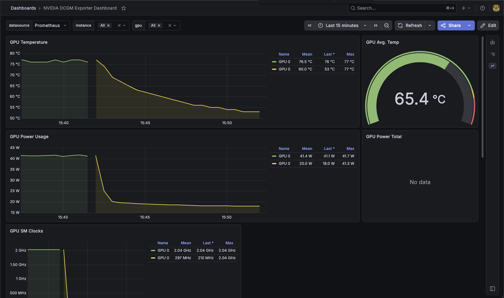

Failure modes hit standing up GPU nodes on GKE, and their fixes. Sections 1-3 cover the
**self-managed GPU Operator** path; on GKE the managed GPU stack avoids them, while off GKE you run
the Operator yourself (see the [portability concepts](/architecture/lessons/portability)).


*The NVIDIA DCGM dashboard: per-GPU temperature, power draw, and SM clocks, for confirming the device is healthy and doing work.*

## 1. GPU Operator pods never schedule: "insufficient quota to match these scopes"

**Symptom:** after the `gpu-operator` Argo CD app syncs, the operator + NFD Deployments stay at
`0/1` with **zero pods** (not even Pending). Events show:

```
Warning  FailedCreate  replicaset/gpu-operator-...  Error creating: insufficient quota to
match these scopes: [{PriorityClass In [system-node-critical system-cluster-critical]}]
```

**Cause:** GKE restricts the `system-node-critical` / `system-cluster-critical` priority classes
to namespaces that explicitly grant them via a scoped `ResourceQuota` (enforced through a
cluster-level admission config; there is no visible ResourceQuota to find). The GPU Operator's
components run at `system-node-critical`, so admission rejects their pods in a fresh namespace.

**Fix:** grant the `gpu-operator` namespace a `ResourceQuota` scoped to those priority classes
(`platform/gpu-operator/prereqs/resourcequota.yaml`), synced **before** the operator (sync-wave 1
< the operator's wave 2). Pods schedule immediately once it exists.

**Diagnose:**
```bash
kubectl -n gpu-operator get events --sort-by=.lastTimestamp | grep -i quota
kubectl -n gpu-operator get deploy gpu-operator -o jsonpath='{.status.conditions[*].message}'
```

## 2. GPU node never provisions: "GCE quota exceeded"

**Symptom:** a pod requesting `nvidia.com/gpu` stays Pending; the autoscaler triggers a scale-up
that then fails and gives up (`cluster_autoscaler_unhelpable_until: Inf`):

```
Warning  FailedScaleUp  ... GCE quota exceeded. Pod is at risk of not being scheduled.
```

**Cause:** GCP GPU quotas default to **0** on new/free-tier projects, and the *regional* GPU quota
is not enough. Two separate quotas gate this:
- **`GPUS_ALL_REGIONS`** (global) gates *all* GPU usage regardless of region. Default 0 → blocks everything.
- **`PREEMPTIBLE_CPUS`** (regional): Spot/preemptible nodes (e.g. `g2-standard-8` = 8 vCPU) count here. Default 0.
  (On-demand nodes use the regional `CPUS` quota instead.)

A non-zero *regional* `NVIDIA_L4_GPUS` is necessary but **not** sufficient: `GPUS_ALL_REGIONS` must also be ≥ the count.

**Fix:** request quota increases (Console → IAM & Admin → Quotas, or the Cloud Console quota page):
- `GPUs (all regions)` → ≥ 1
- `Preemptible CPUs` in the region → ≥ 8 (for a single g2-standard-8 spot node), or drop `--spot` and ensure regional `CPUs` has headroom.

Small increases are often auto-approved within minutes; otherwise up to ~2 days.

**Diagnose:**
```bash
# global
gcloud compute project-info describe --format="json(quotas)" | python3 -c "import sys,json;[print(q) for q in json.load(sys.stdin)['quotas'] if q['metric']=='GPUS_ALL_REGIONS']"
# regional
gcloud compute regions describe us-central1 --format="json(quotas)" | python3 -c "import sys,json;[print(q) for q in json.load(sys.stdin)['quotas'] if q['metric'] in ('NVIDIA_L4_GPUS','PREEMPTIBLE_NVIDIA_L4_GPUS','PREEMPTIBLE_CPUS')]"
```

> Note: an L4 only comes on a `g2-*` machine, and the smallest (`g2-standard-4`) is
> already 4 vCPU. With a 4-vCPU spot default pool, a spot L4 needs `PREEMPTIBLE_CPUS`
> ≥ 8 *region-wide* (default-pool 4 + GPU 4). Granting exactly 8 fits only the
> smallest L4 shape; `g2-standard-8` would need 12.

## 3. Self-managed GPU Operator on GKE: driver validates but the `nvidia` runtime never registers

**Symptom:** with the GPU Operator (`driver.enabled=true`) on a GKE Ubuntu node, the
driver itself works (`nvidia-smi` succeeds inside `nvidia-driver-daemonset`), but
`nvidia-operator-validator`, `nvidia-device-plugin-daemonset`, `nvidia-dcgm-exporter`,
and `gpu-feature-discovery` stay in `Init` / `CreateContainerError`:

```
FailedCreatePodSandBox ... unable to get OCI runtime for sandbox ...:
no runtime for "nvidia" is configured
```

and `nvidia.com/gpu` is never advertised, so GPU pods stay `Pending` with
`Insufficient nvidia.com/gpu`.

**Two distinct causes, in order:**

1. **driver-validation watches the wrong directory.** `hostPaths.driverInstallDir`
   was set to GKE's managed-driver path `/home/kubernetes/bin/nvidia`, but with
   `driver.enabled=true` the operator installs to the chart default
   `/run/nvidia/driver`. The `driver-validation` init container logs
   `failed to validate the driver` on a 5s loop forever. **Fix:** remove the
   `hostPaths.driverInstallDir` override (keep `toolkit.installDir` on the writable
   GKE path). This unblocks validation but exposes cause 2.
2. **the container-toolkit cannot configure GKE's containerd**
   ([gpu-operator#1679](https://github.com/NVIDIA/gpu-operator/issues/1679)). The
   toolkit writes a drop-in to `/etc/containerd/conf.d/99-nvidia.toml` and SIGHUPs
   containerd, but GKE has no `/etc/containerd/config.toml` at the standard path and
   does not import that drop-in dir, so the `nvidia` runtime is never registered.
   `driver.enabled=false` does not help: the toolkit still runs and still fails.

**Resolution:** use the **GKE-managed** GPU stack
(`gpu-driver-version=default`, COS image, GKE's device plugin), and run
`dcgm-exporter` standalone for metrics.

**Diagnose:**
```bash
# is the nvidia runtime registered where kubelet's containerd reads it?
kubectl logs -n gpu-operator -l app=nvidia-container-toolkit-daemonset -c nvidia-container-toolkit-ctr | grep -iE "config|SIGHUP|drop-in"
# does the node advertise the GPU?
kubectl get node -l cloud.google.com/gke-accelerator=nvidia-l4 -o jsonpath='{.items[0].status.allocatable.nvidia\.com/gpu}{"\n"}'
```

## 4. Own dcgm-exporter crashes on GKE: GKE already runs one (embedded DCGM conflict)

**Symptom:** the NVIDIA `dcgm-exporter` Helm chart pod starts then exits 1 immediately on a
GKE GPU node (distroless image → only `Starting dcgm-exporter` then `exit status 1`), even though
the driver libs are mounted and `nvidia-smi` works.

**Cause:** GKE runs its **own** `dcgm-exporter` (DaemonSet in `gke-managed-system`) with an
**embedded DCGM engine** on every GPU node. A second embedded engine can't co-attach to the
same GPUs, so our exporter dies. (Separate, earlier issue: on GKE COS there's no `nvidia`
RuntimeClass, so a self-run exporter must mount the host driver
`/home/kubernetes/bin/nvidia` → `/usr/local/nvidia`, set `LD_LIBRARY_PATH=/usr/local/nvidia/lib64`,
and run privileged, but that only gets you to the embedded-engine conflict above.)

**Fix:** don't run our own. **Scrape GKE's** managed dcgm-exporter into the in-cluster Prometheus
with a `PodMonitor` (`platform/dcgm-metrics`). GKE's exporter already emits `DCGM_FI_DEV_*` with
pod→GPU attribution on `:9400`. On a self-managed / GPU-Operator cluster, run the chart instead.

**Diagnose:**
```bash
kubectl get pods -n gke-managed-system          # GKE's dcgm-exporter, one per GPU node
kubectl logs -n gpu-monitoring -l app.kubernetes.io/name=dcgm-exporter   # own exporter: exit 1
```
