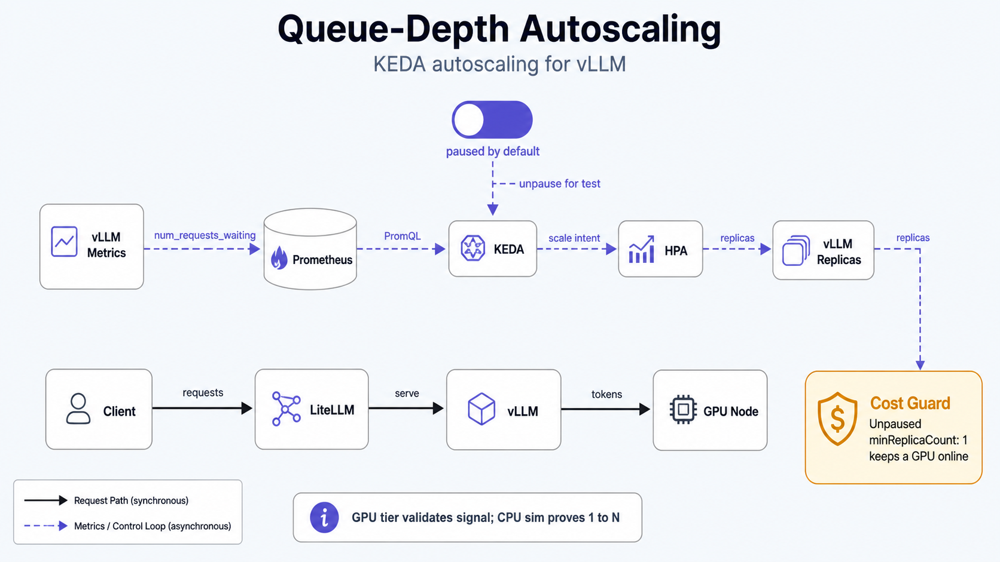

Operating the KEDA autoscaler for vLLM serving (see [GPU signals and autoscaling](/architecture/lessons/gpu-signals-and-autoscaling)). Covers the paused-by-default
posture, the GPU-tier load-test demo, and the free CPU-sim path that proves 1→N scale-out.

## Model

- **KEDA operator** (`platform/keda`, ns `keda`, auto-sync): controller only, no cost.
- **ScaledObject `raw-vllm`** (`serving/raw-vllm/scaledobject.yaml`, ns `serving`) scales the
  vLLM Deployment on `sum(vllm:num_requests_waiting)` (threshold ~5/replica) + a KV-cache secondary.
  **Ships paused.** While paused KEDA touches no replicas, so `make vllm-up/down` and $0-idle are
  unaffected. Un-pause only for a deliberate load test, then re-pause.

A live ScaledObject owns `/spec/replicas`. An unpaused `minReplicaCount: 1` keeps a GPU node up
24/7 (~$240/mo) and overrides `make vllm-down`: that is why it is paused by default. Never leave
it un-paused on the GPU tier.



## 1. Toggle the autoscaler

```bash
make keda-demo-up    # un-pause the ScaledObject (KEDA starts driving replicas)
make keda-demo-down  # re-pause (KEDA stops; return to manual make vllm-up/down)
```

These flip the `autoscaling.keda.sh/paused` annotation live. The app is manual-sync, so selfHeal
will not revert the toggle; a manual `argocd sync` reapplies the committed default (`paused: true`),
the safe state, so that is fine.

## 2. GPU-tier load test (validates the trigger; single-GPU caps scale-out at 1)

`GPUS_ALL_REGIONS=1` caps the GPU pool at one node, so real `raw-vllm` cannot exceed 1 replica.
Use this to confirm KEDA **reads the metric and computes scale intent**; prove 1→N on the sim (§3).

```bash
# Restore the cluster first: needs a live GPU + Prometheus.
make vllm-up                 # 1 warm replica
make keda-demo-up            # un-pause autoscaling

kubectl -n serving get scaledobject raw-vllm                 # READY=True, ACTIVE flips on load
kubectl -n serving get hpa keda-hpa-raw-vllm -w              # KEDA-generated HPA; watch TARGETS

# Drive queue depth (concurrent requests > what 1 replica drains):
make bench                   # or: hey/vegeta against the gateway with high concurrency

# Observe: vllm:num_requests_waiting climbs → HPA desired rises (capped at 1 here by quota).
kubectl -n serving describe scaledobject raw-vllm | sed -n '/Triggers/,$p'

make keda-demo-down          # re-pause
make vllm-down               # release the GPU node ($0 idle)
```

If the HPA shows `<unknown>` for TARGETS, KEDA cannot read the metric; see §4.

## 3. Free CPU-sim scale-out proof (1→N, $0 GPU)

The `llm-d-inference-sim` backends (ns `inference`, no GPU) emit the same
`vllm:num_requests_waiting`. Scrape them into Prometheus and point a throwaway ScaledObject at them
to demonstrate genuine 1→N without GPU cost. These are validation aids: apply on demand, delete
after (not committed manifests).

```bash
# Sim backends must be running:
kubectl -n inference scale deploy/vllm-sim --replicas=1

# Land sim metrics in cluster Prometheus:
kubectl -n inference apply -f - <<'EOF'
apiVersion: monitoring.coreos.com/v1
kind: ServiceMonitor
metadata:
  name: vllm-sim
  namespace: inference
spec:
  selector:
    matchLabels:
      app: vllm-sim
  endpoints:
    - port: http
      path: /metrics
      interval: 15s
EOF
# (requires a Service selecting app=vllm-sim on port `http`; add one if the demo lacks it.)

# Autoscale the sim on queue depth:
kubectl apply -f - <<'EOF'
apiVersion: keda.sh/v1alpha1
kind: ScaledObject
metadata:
  name: vllm-sim
  namespace: inference
spec:
  scaleTargetRef:
    name: vllm-sim
  pollingInterval: 15
  cooldownPeriod: 60
  minReplicaCount: 1
  maxReplicaCount: 5
  triggers:
    - type: prometheus
      metadata:
        serverAddress: http://prometheus-operated.monitoring.svc:9090
        metricName: vllm_num_requests_waiting
        query: sum(vllm:num_requests_waiting{namespace="inference"})
        threshold: "5"
EOF

# Drive load through the gateway, watch the sim scale 1→N→min:
kubectl -n inference get hpa keda-hpa-vllm-sim -w

# Cleanup:
kubectl -n inference delete scaledobject vllm-sim
kubectl -n inference delete servicemonitor vllm-sim
```

## 4. Troubleshooting

**HPA TARGETS `<unknown>` / ScaledObject `READY=False`.** KEDA can't reach Prometheus or the query
returns no series.
- Confirm the Prometheus service name: `kubectl -n monitoring get svc | grep prometheus`. The
  ScaledObject points at `prometheus-operated.monitoring.svc:9090` (the operator's stable headless
  service). If your kube-prometheus-stack release exposes a different service, update
  `serverAddress`.
- Confirm the metric exists and the name is right (vLLM **V1 renamed** several series):
  `kubectl -n serving port-forward deploy/raw-vllm 8000 & curl -s localhost:8000/metrics | grep -E 'num_requests_waiting|cache_usage'`.
  Expect `vllm:num_requests_waiting` and `vllm:kv_cache_usage_perc` (NOT `gpu_cache_usage_perc`).
  Fix the `query` in `scaledobject.yaml` if a name differs.

**ScaledObject never scales in.** `cooldownPeriod` is 300s (5 min) by design to avoid flapping on a
slow-cold-start workload; wait it out.

**It won't stop bringing the GPU up.** You left it un-paused. `make keda-demo-down` then
`make vllm-down`. The committed default is paused.

See also: `vllm-serving.md` (the `replicas`/`ignoreDifferences` interaction), `staged-bring-up.md`.
