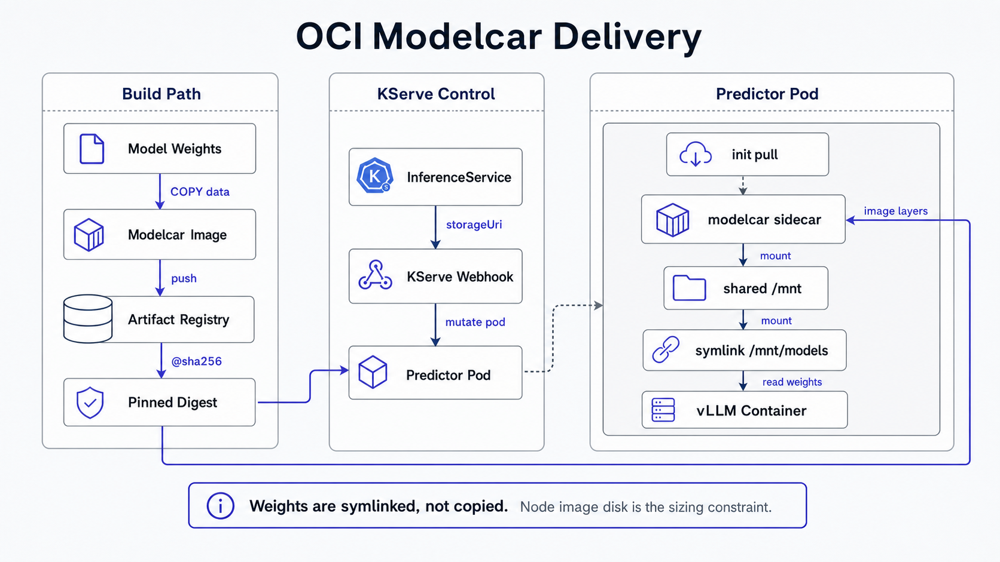

Serve a model from a **digest-pinned `oci://` modelcar** on KServe: the cloud-agnostic model-delivery
default for big models. Same Qwen2.5-0.5B / vLLM v0.23.0 engine as `qwen-cpu`
(runbook `kserve.md`), but on a real GPU with weights baked into an OCI image instead of a pre-staged
PVC. Manifest: `serving/kserve/inferenceservice-modelcar.yaml`. Modelcar is enabled cluster-wide via
`platform/kserve/values.yaml` (`kserve.storage.enableModelcar: true`).

## 0. How modelcar works (so the steps make sense)

KServe sees `predictor.model.storageUri: oci://...` and **auto-injects** into the pod: a modelcar
sidecar + a no-op init-container (pre-pulls the image), `spec.shareProcessNamespace: true`, a shared
`emptyDir` at `/mnt`, an `ln -sf` so the weights appear at `/mnt/models`, and `runAsUser=1010`. The
weights are **symlinked, not copied**: no 2x disk, the big-model win. vLLM reads `--model=/mnt/models`.
The whole image is pulled to the **node's image-layer disk**, so node disk (not emptyDir) is the sizing
constraint for large models.



## 1. One-time: Artifact Registry repo + auth

The GKE OpenTofu root creates the Docker Artifact Registry repo and grants the GKE node service
account `roles/artifactregistry.reader` on it:

```sh
make tf-apply
```

**Pull auth (modelcar uses image-pull creds, NOT KServe storage creds):** the modelcar image is pulled
by the kubelet like any container image. For cross-project / non-WI setups set `imagePullSecrets` on
the predictor pod's ServiceAccount. This differs from `s3://`/`gs://` storage, which use KServe
storage-secret credentials.

## 2. Build + push the modelcar, pin the digest

```sh
make modelcar-build MODEL=Qwen/Qwen2.5-0.5B-Instruct \
  IMAGE=<region>-docker.pkg.dev/<proj>/<repo>/qwen2.5-0.5b:v1
```

No local Docker? Use GCP Cloud Build (`serving/kserve/modelcar/cloudbuild.yaml`) or swap in
kaniko/podman; the Dockerfile + `data/` layout are tool-agnostic. The build prints the immutable
`@sha256:` digest. **Pin it** in `inferenceservice-modelcar.yaml` `storageUri`
(`oci://<region>-docker.pkg.dev/<proj>/<repo>/qwen2.5-0.5b@sha256:<digest>`). Never a tag/`:latest`: a
digest pins `IfNotPresent` (node-cached after first pull); a tag forces `Always` (re-pulls the multi-GB
image every pod start, defeating the modelcar caching win).

**Node disk sizing for big models:** the full image (30-70 GB for a real model) lands on the node's
image-layer disk. Size the GPU node boot/image disk accordingly (e.g. >=200 GB pd-balanced) or hit
`ImageGCFailed` / disk-pressure eviction on first pull.

## 3. SMOKE-TEST storageUri placement FIRST (the one unverified item)

The exact field the v0.19 webhook honors to wire `/mnt/models` for a **custom container** is the single
unverified item; every official example is model+runtime. **Verify
in a scratch namespace before trusting the committed manifest:**

```sh
kubectl create ns modelcar-smoke
# copy inferenceservice-modelcar.yaml with namespace: modelcar-smoke + the pinned digest, apply it
kubectl -n modelcar-smoke apply -f /tmp/qwen-oci-smoke.yaml
# inspect the MUTATED pod: confirm the webhook did its job:
POD=$(kubectl -n modelcar-smoke get pod -l serving.kserve.io/inferenceservice=qwen-oci -o name | head -1)
kubectl -n modelcar-smoke get "$POD" -o jsonpath='{.spec.shareProcessNamespace}'; echo   # -> true
kubectl -n modelcar-smoke get "$POD" -o jsonpath='{.spec.initContainers[*].name}'; echo  # modelcar init present
kubectl -n modelcar-smoke get "$POD" -o jsonpath='{.spec.containers[*].name}'; echo       # kserve-container + modelcar sidecar
kubectl -n modelcar-smoke exec "$POD" -c kserve-container -- ls -l /mnt/models            # symlink populated
```

If `/mnt/models` is empty / no sidecar injected, the webhook did NOT honor `predictor.model.storageUri`
for the custom container, switch to the annotation/`STORAGE_URI` mechanism (research §2) and re-test
before deploying. Clean up: `kubectl delete ns modelcar-smoke`.

## 4. Deploy `qwen-oci`

`qwen-oci` ships in the `kserve-demo` Argo app (manual-sync, paid GPU). After pinning the
digest and committing:

```sh
argocd app sync kserve-demo
kubectl -n kserve get isvc qwen-oci          # wait for Ready
```

## 5. GPU validate

```sh
GW=$(kubectl -n kserve get gateway kserve-ingress-gateway -o jsonpath='{.status.addresses[0].value}')
H=qwen-oci-kserve.example.com
curl -s -H "Host: $H" http://$GW/v1/models                         # -> qwen2.5-0.5b-instruct
curl -s -H "Host: $H" -H 'Content-Type: application/json' http://$GW/v1/chat/completions \
  -d '{"model":"qwen2.5-0.5b-instruct","messages":[{"role":"user","content":"ping"}],"max_tokens":16}'
# -> 200, system_fingerprint vllm-0.23.0
```

**Confirm zero HF egress** (offline serving): `HF_HUB_OFFLINE=1` + `TRANSFORMERS_OFFLINE=1` are set;
vLLM must never hit huggingface.co. Spot-check the pod logs for no HF download lines, and (if egress
logging is available) confirm no traffic to `huggingface.co`.

## 6. Scale to zero (idle cost)

```sh
kubectl -n kserve annotate isvc qwen-oci serving.kserve.io/stop=true --overwrite   # pause
kubectl -n kserve annotate isvc qwen-oci serving.kserve.io/stop-                    # resume
```

`minReplicas: 0` lets KServe scale the predictor to zero on idle (the GPU node releases → $0 idle).
Note: scale-to-zero deletes the node **and** its node-warm image cache, so the next cold start re-pulls
the modelcar: a validation caveat, not an argument against modelcar. The node-warm cache for warm
multi-node pools (LocalModelCache) is a deferred production capability.
