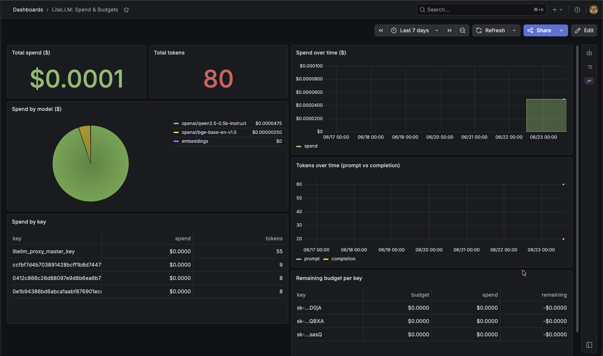

The Grafana "LiteLLM Spend & Budgets" dashboard (uid `litellm-spend`). Reads LiteLLM's spend
data directly from CNPG Postgres via a least-privilege read-only role: no LiteLLM Enterprise, no
Prometheus, no Langfuse.


*Spend over time, spend by model and by key, and remaining budget per key, served from CNPG Postgres.*

## Model

```
LiteLLM proxy → "LiteLLM_SpendLogs" rows → CNPG litellm-pg (db litellm)
Grafana (ns monitoring) → Postgres datasource (role grafana_ro, litellm-pg-rw:5432) → SQL panels
```

- **DB role** `grafana_ro`: CNPG managed role, `pg_read_all_data` (SELECT-only). Defined in
  `platform/litellm/db/cluster.yaml`; password GSM `litellm-grafana-ro-password` → ESO secret
  `litellm-grafana-ro` (ns litellm).
- **Datasource**: ESO-rendered Secret `grafana-datasource-litellm` (ns monitoring) labelled
  `grafana_datasource: "1"`; the Grafana datasource sidecar auto-imports it
  (`platform/observability/values.yaml`).
- **Dashboard**: `dashboards/litellm/litellm-spend-dashboard.json` (uid `litellm-spend`), loaded
  by the `grafana-litellm` app in the `llm-gateway` profile.

## 1. Prereq: the secret (do this first)

```bash
# read-only DB password (any strong value; CNPG sets the role to it)
printf '%s' "$(openssl rand -base64 24)" | gcloud secrets create litellm-grafana-ro-password --data-file=-
```
Then sync `litellm-bootstrap` (creates the role + ESO) and `grafana-litellm` (datasource +
dashboard). CNPG reconciles the `grafana_ro` role from the secret automatically.

## 2. View it

```bash
kubectl -n monitoring port-forward svc/observability-grafana 3000:80   # adjust svc name if different
# Grafana → Dashboards → "LiteLLM Spend & Budgets" (uid litellm-spend)
```
Make a budgeted call through LiteLLM first (see `litellm.md` §3) so there are spend rows to show.

## 3. Troubleshooting

**Datasource missing in Grafana.** The datasource sidecar must be enabled
(`grafana.sidecar.datasources.enabled: true`, `searchNamespace: ALL`) and the Secret must carry the
`grafana_datasource: "1"` label. Check it rendered:
```bash
kubectl -n monitoring get secret grafana-datasource-litellm -o jsonpath='{.metadata.labels}'
kubectl -n monitoring logs deploy/observability-grafana -c grafana-sc-datasources | tail
```

**Datasource present but "connection refused" / auth failed.**
- Confirm the role exists: `kubectl -n litellm exec -it litellm-pg-1 -- psql -U postgres -c '\du grafana_ro'`.
- Confirm the ESO secret resolved: `kubectl -n litellm get secret litellm-grafana-ro` and
  `kubectl -n litellm get externalsecret litellm-grafana-ro`.
- The datasource targets `litellm-pg-rw` (the writable primary). With a single instance the `-ro`
  service has **no endpoints**: do not point the datasource at it until HA adds replicas.

**Empty panels.** No spend logged yet (make a call), or the time range predates any traffic, or
LiteLLM changed a table/column name. The SQL quotes `"LiteLLM_SpendLogs"` / `"LiteLLM_VerificationToken"`
and `"startTime"`; re-check column names with `\d "LiteLLM_SpendLogs"` if a LiteLLM bump breaks a panel.

## 4. Not here

Per-request prompt/token tracing is **Langfuse (deferred)**: its v3 footprint is the reason.
LiteLLM's own Prometheus metrics are Enterprise-gated and intentionally unused.
