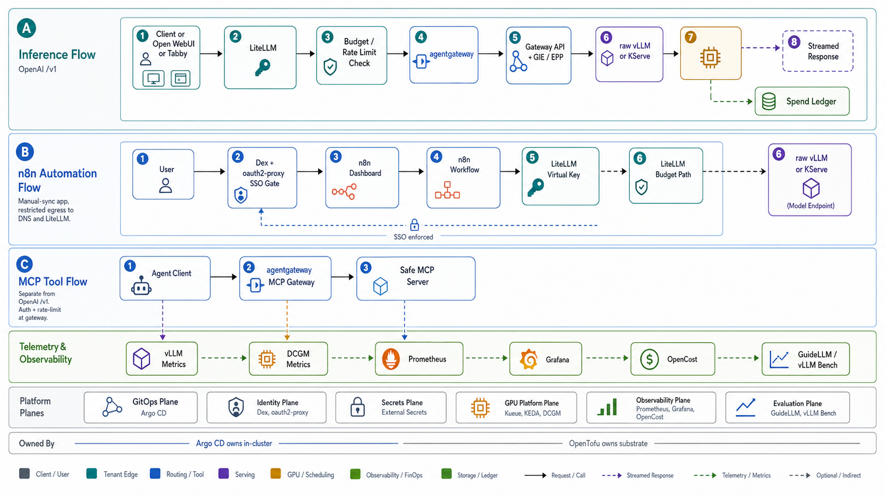

n8n is an optional automation surface. Enabling it creates an Argo CD Application; it does not sync
until an operator chooses to bring it up.



## Enable

1. Set `features.n8n: true` in `environments/ai-dev/config.yaml`.
2. Run `make resolve-groups`.
3. Run `make seed-secrets` so `n8n-encryption-key` exists in the secret backend.
4. Apply a profile that includes `identity`, `public-edge`, `llm-gateway`, and `n8n`, then manually
   sync the `n8n` Application in Argo CD.

The n8n app uses standalone mode: SQLite on the `n8n` PVC. Queue mode needs external Postgres and Redis
and is intentionally not part of the lab deployment.

## Access

When the public edge is enabled, n8n is exposed at:

```text
https://n8n.<domain>
```

`make fork-init` rewrites the domain for forks.

n8n authenticates in two layers. The dashboard route is fail-closed behind Dex through oauth2-proxy
before n8n serves any page, so only a Dex-authenticated identity reaches n8n. That edge gate is the
access boundary. Underneath it, the Community edition keeps its own owner login: n8n native single
sign-on (SAML or OIDC) is a Business and Enterprise feature, and n8n removed the
`N8N_USER_MANAGEMENT_DISABLED` variable in version 1.0, so the built-in login cannot be turned off on
the OSS edition. The owner account is a second, instance-local credential behind the edge SSO gate.

To skip the interactive owner-account setup screen, pre-provision the instance owner from the
environment (n8n v2.17.0 and later): set `N8N_INSTANCE_OWNER_MANAGED_BY_ENV=true` with
`N8N_INSTANCE_OWNER_EMAIL` and a bcrypt `N8N_INSTANCE_OWNER_PASSWORD_HASH` (a plaintext password breaks
login). Flow the hash through the secret backend and ESO the same way as `dex-admin-hash` so the owner
stays GitOps-managed with no manual setup step.

## Secrets

`make seed-secrets` creates:

```text
n8n-encryption-key
```

ESO projects it into `n8n/n8n-core-secrets` as `N8N_ENCRYPTION_KEY`. The same Secret also carries the
non-secret host, port, and protocol values because the official chart expects all core settings in one
Secret.

The in-cluster `n8n-key-minter` Job creates `n8n/n8n-litellm-secrets` with a LiteLLM virtual key. That
key is exposed to the pod as `OPENAI_API_KEY`; `OPENAI_API_BASE_URL` points at the in-cluster LiteLLM
`/v1` endpoint.

## Network posture

The n8n main pod is restricted to:

- ingress from the shared agentgateway data plane
- egress to cluster DNS
- egress to LiteLLM on port `4000`

This keeps AI calls on the LiteLLM budget path. Add explicit NetworkPolicy before enabling workflows
that call other internal or external services.

## SSO check

Unauthenticated dashboard access should redirect to Dex:

```sh
curl -I https://n8n.<domain>
```

Expected: an HTTP redirect to `portal.<domain>/oauth2/start` or the Dex login flow. A direct
HTTP 200 from n8n is a failed SSO gate.
