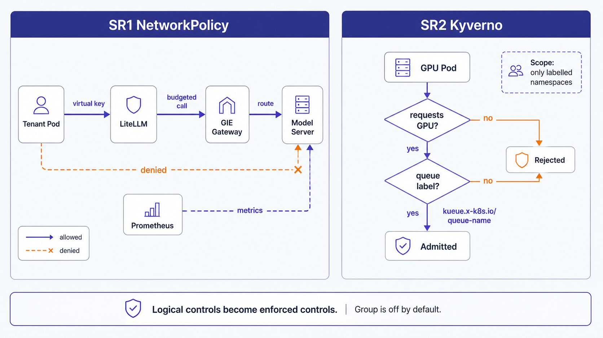

Operating the `security` capability group. It turns two *logical* controls into *enforced* ones:
**SR1** forces all model traffic through LiteLLM's budget/key path, and **SR2** stops GPU pods from
bypassing Kueue quota. Both are **off by default**: a single-tenant deployment never hits these gaps,
so they ship dormant and pull forward with multi-tenancy / governance.



## Model

- **`network-policies`** (SR1): native `networking.k8s.io/v1` policies on `serving` and `inference`:
  a default-deny-ingress plus an allow-list. Only `litellm`, `inference`, `agentgateway-system`, and
  `monitoring` may reach the model servers + GIE gateway. Tenant namespaces can reach **only** LiteLLM,
  so virtual keys and budgets are no longer network-bypassable.
- **`kyverno`** (SR2): the Kyverno admission engine (Helm chart 3.8.1), ns `kyverno`.
- **`kyverno-policies`** (SR2): `ClusterPolicy require-kueue-queue-name`: rejects any pod requesting
  `nvidia.com/gpu` that lacks the `kueue.x-k8s.io/queue-name` label, **scoped to namespaces labelled
  `llm-platform/kueue-managed=true`**. The platform's own model servers (`serving`) are operator-managed
  and carry no queue-name, so they are deliberately out of scope.

Native NetworkPolicy keeps the manifests CNI-portable (Calico / Cilium / Antrea). Enforcement needs a
NetworkPolicy-capable dataplane: on GKE that is **Dataplane-V2** (`datapath_provider = ADVANCED_DATAPATH`,
set at cluster creation; retrofitting forces node recreation). Without it the policies are
authored-but-not-enforced.

## 1. Enable the group

```bash
# environments/<env>/config.yaml
features:
  security: true        # was false

make resolve-groups     # regenerates clusters/<env>/groups.generated.yaml
git add -A && git commit -m "enable security enforcement" && git push
```

The platform-layer ApplicationSet picks up `group-security` on its next reconcile. Argo's repo-server
caches git revisions; after pushing, restart it (or wait the poll) so the appset reads the new
`groups.generated.yaml`, otherwise the group will not appear:

```bash
kubectl -n argocd rollout restart deploy/argo-cd-argocd-repo-server
```

SR1 requires the `serving` + `llm-gateway` layers to be applied (the policies target the `serving` and
`inference` namespaces); until they exist the NetworkPolicy apps selfHeal-retry.

## 2. Kyverno CRD install caveat

Kyverno's `clusterpolicies` / `policies` CRDs exceed Argo CD's **client-side apply** annotation limit
(256 KB), so a first sync can stall with `metadata.annotations: Too long` and the admission controller
crash-loops its sanity check (`failed to check CRD clusterpolicies.kyverno.io is installed`). The app
carries `ServerSideApply=true`; if Argo still applies client-side, bootstrap the CRDs once and pre-create
the namespace (avoids an RBAC-before-namespace race):

```bash
kubectl create namespace kyverno
helm repo add kyverno https://kyverno.github.io/kyverno/ && helm repo update kyverno
helm template kyverno kyverno/kyverno --version 3.8.1 --include-crds | kubectl apply --server-side
```

Then re-sync the `kyverno` app; the admission controller passes its sanity check once the CRDs exist.

## 3. Validate SR1 (NetworkPolicy)

A pod outside the allow-list must be refused; a trusted-namespace pod must connect. Using the
`embeddings` Service (port 80) in `serving` as the target:

```bash
# Untrusted (default ns) → expect a connection timeout (denied)
kubectl run sr1-deny --rm -i --restart=Never -n default --image=curlimages/curl:8.10.1 --command -- \
  curl -sS -m 8 -o /dev/null -w "HTTP:%{http_code}\n" http://embeddings.serving.svc.cluster.local/health

# Trusted (monitoring ns) → expect HTTP 200 (allowed)
kubectl run sr1-allow --rm -i --restart=Never -n monitoring --image=curlimages/curl:8.10.1 --command -- \
  curl -sS -m 8 -o /dev/null -w "HTTP:%{http_code}\n" http://embeddings.serving.svc.cluster.local/health
```

`monitoring` is in the allow-list on purpose: Prometheus scrapes the model servers' `/metrics`, so the
spend/serving dashboards keep working under the lockdown.

## 4. Validate SR2 (Kyverno admission)

Admission is evaluated at pod creation, so no GPU node is needed. Label a tenant namespace, then create
GPU pods with and without the queue-name label:

```bash
kubectl create ns sr2-tenant
kubectl label ns sr2-tenant llm-platform/kueue-managed=true

# No queue-name label → DENIED by require-kueue-queue-name
kubectl -n sr2-tenant run gpu-noqueue --image=registry.k8s.io/pause:3.9 --restart=Never \
  --overrides='{"spec":{"containers":[{"name":"c","image":"registry.k8s.io/pause:3.9","resources":{"limits":{"nvidia.com/gpu":"1"}}}]}}'

# With the label → ADMITTED
kubectl -n sr2-tenant run gpu-queued --image=registry.k8s.io/pause:3.9 --restart=Never \
  --labels='kueue.x-k8s.io/queue-name=gpu-lq' \
  --overrides='{"spec":{"containers":[{"name":"c","image":"registry.k8s.io/pause:3.9","resources":{"limits":{"nvidia.com/gpu":"1"}}}]}}'

kubectl delete ns sr2-tenant
```

## 5. Bring a tenant namespace under SR2

Label it; unlabeled namespaces are untouched (the policy is opt-in per namespace):

```bash
kubectl label ns team-a llm-platform/kueue-managed=true
```

## 6. Disable

Set `features.security: false`, `make resolve-groups`, commit + push. Argo prunes `group-security`
(NetworkPolicies, Kyverno, the ClusterPolicy) via the cascade finalizer.
