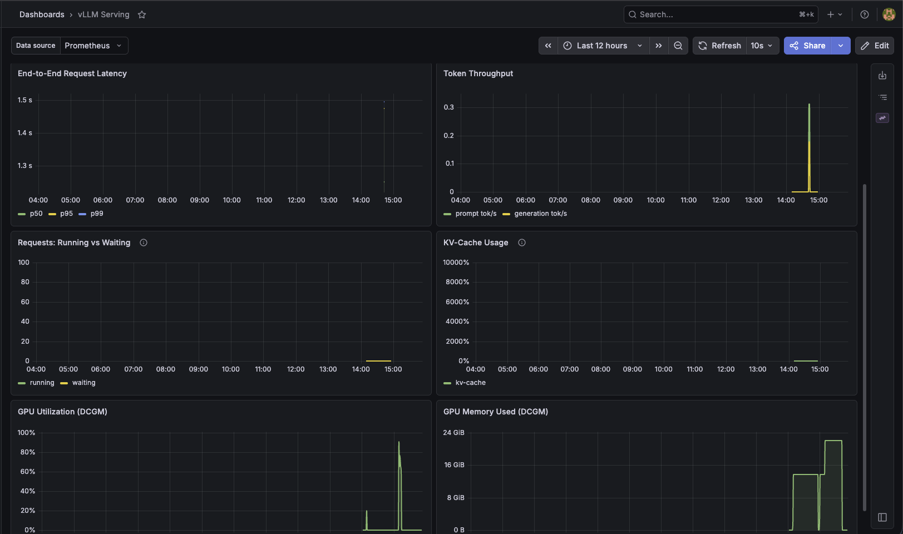

Operating and debugging the `serving/raw-vllm` OpenAI-compatible endpoint: scale-to-zero,
GPU-capacity fallback, and the GitOps gotchas hit standing it up.


*The vLLM Serving dashboard: end-to-end latency, token throughput, running vs waiting requests, KV-cache usage, and DCGM GPU utilization and memory.*

## Operating it (default-off, scale-to-zero)

The Deployment ships `replicas: 0`: no GPU node, $0 idle. Bring it up for a session,
tear it down after:

```bash
make vllm-up      # scale to 1 → GPU node provisions → image pull → model load
make vllm-smoke   # authenticated OpenAI chat request, asserts a completion
make vllm-down    # scale to 0 → GPU node drains and releases
```

`make vllm-up` blocks on `kubectl rollout status` (up to 18m: a cold node is provision +
~8GB image pull + model download + CUDA-graph capture). The model-cache PVC keeps the
weights across restarts so a warm node skips the HuggingFace re-pull.

## 1. `make vllm-up` is reverted to 0 by Argo CD

**Symptom:** you scale to 1, the pod starts (or even loads the model), then the Deployment
drops back to `0/0` and the pod is deleted within a minute or two.

**Cause:** the App pins `replicas: 0` in git with `ignoreDifferences` on `/spec/replicas`.
`ignoreDifferences` **only suppresses the diff display**; it does not exclude the field
from the sync patch. So the next auto-sync reapplies `replicas: 0` and undoes the manual
scale.

**Fix:** add `RespectIgnoreDifferences=true` to the App's `syncOptions` (alongside
`ignoreDifferences`). That makes sync skip the ignored field, so a manual `kubectl scale`
sticks, the standard pattern for an externally-scaled (HPA-style) Deployment.

```yaml
syncPolicy:
  syncOptions: [RespectIgnoreDifferences=true]
ignoreDifferences:
  - group: apps
    kind: Deployment
    name: raw-vllm
    jsonPointers: [/spec/replicas]
```

## 2. GPU pod stuck Pending: "GCE out of resources"

**Symptom:** after `make vllm-up` the pod is `Pending`; events show
`FailedScaleUp ... GCE out of resources` and the autoscaler goes into backoff.

**Cause:** the requested GPU has no stock in the zone right now. L4 (`g2`) in
`us-central1-a` is frequently exhausted, on both spot **and** on-demand.

**Fix:** the Deployment is **GPU-type-agnostic**: it requests `nvidia.com/gpu: 1` and
tolerates the GPU taint but pins no `cloud.google.com/gke-accelerator`, so the autoscaler
falls back to whatever GPU pool has capacity. Keep a second pool for this:

Set `gpu_node_pool_name = "gpu-t4"`, `gpu_machine_type = "n1-standard-4"`, and
`gpu_accelerator_type = "nvidia-tesla-t4"` in `infra/gke/terraform/terraform.tfvars`, then run
`make tf-apply`.

Both pools are scale-to-zero ($0 idle). The 0.5B model fits either (L4 23GB / T4 16GB).
Check the live capacity / quota before assuming it's gone for good:

```bash
gcloud compute regions describe us-central1 --format=json \
  | jq '.quotas[] | select(.metric|test("NVIDIA_(L4|T4)_GPUS|GPUS_ALL_REGIONS"))'
```

## 3. Rollout deadlocks on a template change

**Symptom:** editing the Deployment (e.g. args) while it's scaled up leaves a new pod
`Pending` forever with `FailedScaleUp`, and the old pod never terminates.

**Cause:** the project's `GPUS_ALL_REGIONS` quota is **1**: only one GPU node cluster-wide.
A `RollingUpdate` surge pod needs a *second* GPU before the old one frees, which the quota
forbids, so the roll never completes.

**Fix:** the Deployment uses `strategy: Recreate`: old pod terminates before the new one
schedules. Correct for single-GPU serving; the brief downtime is unavoidable with one GPU.

## 4. Auth: `/v1/*` needs the key, `/metrics` does not

vLLM enforces `VLLM_API_KEY` (ESO-provisioned from GCP Secret Manager) on `/v1/*` but
serves `/health` and `/metrics` unauthenticated, so the Prometheus ServiceMonitor scrapes
without credentials. A `401` on a chat request means the `vllm-api-key` Secret is missing or
stale:

```bash
kubectl -n serving get externalsecret vllm-api-key   # want STATUS=SecretSynced READY=True
```

If it's `SecretSyncError`, the backing Secret Manager value doesn't exist yet; create it
(see `serving/raw-vllm/README.md`).

## Diagnose

```bash
kubectl -n serving get pods -o wide
kubectl -n serving logs deploy/raw-vllm --tail=50          # model load / OOM / tokenizer errors
kubectl -n serving get events --sort-by=.lastTimestamp | tail
# Prometheus target + a live metric (port-forward the prometheus svc):
curl -s 'http://localhost:9090/api/v1/query?query=vllm:num_requests_running'
```
