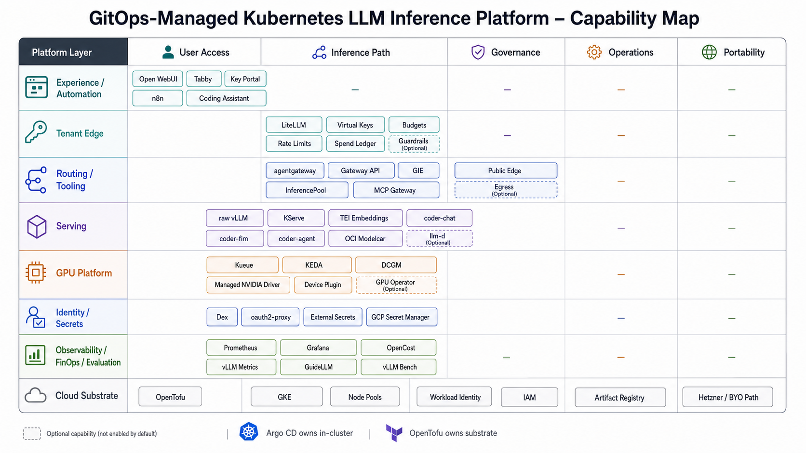

How the repository is organized, and the one structural rule that explains most of it.

## The ownership boundary

Two systems own two halves of the platform, and the split is hard:

- **OpenTofu owns the cloud substrate.** The cluster, node pools, Workload Identity, IAM, and
  Artifact Registry. Everything under `infra/`. Argo CD never touches it.
- **Argo CD owns everything inside Kubernetes.** Controllers, CRDs, workloads, and secret sync,
  reconciled from this repository by GitOps. OpenTofu never touches it.

Almost every directory below sits on one side of that line.

## Top-level directories

| Path | What it holds |
| --- | --- |
| `infra/` | Cloud substrate per provider (GKE today, Hetzner as the portability target). OpenTofu roots plus thin cluster prerequisites. |
| `bootstrap/` | The Argo CD install (pinned Helm chart) and repo credential. The GitOps entry point. |
| `clusters/<cluster>/` | The deployment-profile catalog for a cluster: `catalog/` (child Applications grouped by capability), `appsets/` (one ApplicationSet per layer), `projects/` (the `platform` AppProject guardrail). |
| `platform/` | Cluster services: observability, external-secrets, Kueue, KEDA, cert-manager, identity, security policy. |
| `serving/` | Model servers: raw vLLM, KServe, and llm-d. |
| `routing/` | The inference gateway, edge gateway, and MCP gateway. |
| `experience/` | End-user and automation surfaces: Open WebUI, Tabby, key-portal, and n8n. |
| `workloads/` | GPU smoke job and Kueue demos. |
| `benchmarks/` | The serving benchmark jobs and recorded runs. |
| `dashboards/` | Grafana dashboards. |
| `environments/<env>/config.yaml` | The single source of fork configuration: repository URL, project ID, domain, and feature flags. |
| `scripts/` | The resolver and operations scripts that the `make` targets call. |
| `tests/` | Golden-file tests for the config resolvers. |
| `docs/public/` | This documentation site. The only part of `docs/` that publishes. |

## How a component is wired

A running component appears in three places:

1. **The implementation** lives under the matching top-level directory (`platform/`, `serving/`,
   `routing/`, `workloads/`) as Helm values or manifests.
2. **A child Argo `Application`** points at it from `clusters/<cluster>/catalog/<group>/`. These
   directories hold only plain `Application` YAML, so a `directory.recurse` source renders them
   cleanly.
3. **A capability flag** in `config.yaml` decides whether that group's Applications exist at all.

Three independent axes control what is deployed:

- **Profile** selects which layers you apply, with `make root PROFILE=…`. See [make targets](/reference/make-targets).
- **Features** select which capability groups exist, through `config.yaml`. Run `make resolve-groups`
  to regenerate `clusters/<cluster>/groups.generated.yaml`.
- **Bring-up** is each Application's own sync policy: a manual-sync app is created but not deployed
  until you sync it.

Files ending in `.generated.yaml` are build artifacts. Regenerate them with the resolver scripts
rather than editing by hand.
