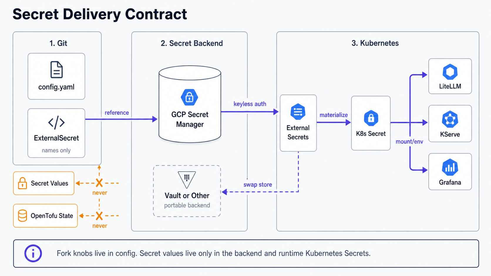

Secret values never live in git. They are stored in your secret backend and projected into the
cluster by the External Secrets Operator. You configure very few of them by hand.

## How secrets are delivered

```
make seed-secrets  ──▶  secret backend (GSM / AWS / Vault / ...)  ──▶  ESO  ──▶  Kubernetes Secret
   (random values)        (durable source of truth)              (ExternalSecret)   (consumed by pods)
```



For the default `gcpsm` backend, `make seed-secrets` writes the internal random values via `gcloud`.
For any other backend it has no assumed CLI, so it prints the key list plus the
[ESO provider docs](https://external-secrets.io/latest/provider/) link and you create the values
yourself (`scripts/seed-secrets.sh`). Every `ExternalSecret` references one store named `secret-store`,
so ESO materialises them as native Kubernetes Secrets at runtime. The backend is the single source of
truth, which is why secrets survive a cluster rebuild.

## The secrets

| Secret | Source | Needed when |
|---|---|---|
| `litellm-master-key`, `litellm-salt-key` | auto-generated (`make seed-secrets`) | always |
| `vllm-api-key` | auto-generated | always |
| `litellm-db-password`, `litellm-grafana-ro-password` | auto-generated | always |
| `n8n-encryption-key` | auto-generated | n8n enabled |
| `oauth2-proxy-cookie-secret` | auto-generated | identity enabled |
| `dex-admin-password`, `dex-admin-hash` | auto-generated (password plus bcrypt hash; password restored to `secrets/dex-admin-password`) | identity enabled |
| `dex-*-client-secret` (6) | auto-generated | identity enabled |
| `cloudflare-api-token` | **you provide** | `dns.automate` with `dns.provider: cloudflare` |
| `anthropic-api-key` | **you provide** | routing the Anthropic egress provider |
| `hf-token` | **you provide** | serving a gated Hugging Face model |

After `make seed-secrets`, a typical fork has **zero to three** secrets left to create by hand. A
minimal run (local models, no public DNS) needs none.

## Backend access

How the cluster authenticates to the backend itself:

| Setup | Credential |
|---|---|
| GKE + Google Secret Manager (default) | none, keyless Workload Identity |
| Off-GKE + GSM | one service-account JSON key (`secret-store-key`), seeded once |
| AWS / Azure / Vault | that provider's ESO auth, per the [ESO provider docs](https://external-secrets.io/latest/provider/) |
| No hosted store | the ESO Kubernetes provider, see below |

## No hosted secret store

You do not need a cloud secret manager. If you have none (bare metal, or you already manage secrets with
Sealed Secrets or `kubectl`), point the store at the **ESO [Kubernetes provider](https://external-secrets.io/latest/provider/kubernetes/)**,
which reads Secrets from an in-cluster source namespace. ESO stays the single mechanism; only the store's
`provider` block changes.

```yaml
# platform/external-secrets/config/clustersecretstore.yaml  (rendered as a placeholder when
# secret_backend is non-gcpsm; fill it in once, the resolver will not clobber it)
spec:
  provider:
    kubernetes:
      remoteNamespace: secret-source        # the namespace holding your source Secrets
      server:
        url: https://kubernetes.default.svc
        caProvider: { type: ConfigMap, name: kube-root-ca.crt, key: ca.crt }
      auth:
        serviceAccount: { name: eso-reader, namespace: external-secrets }  # + RBAC: read Secrets in secret-source
```

You then create the source Secrets in `secret-source` however you like, including committing them as
**Sealed Secrets** (encrypted, safe in git) that the sealed-secrets controller decrypts in place. Use the
[secret contract](#secret-contract) for the exact names and keys.

One adaptation to know: a Kubernetes Secret is a key/value map, not a single string, so the Kubernetes
provider needs `remoteRef.property` to name the data key (a hosted string backend like GSM does not).
The platform's `ExternalSecret`s are single-value, so under this provider add `property:` to each,
matching the data key of your source Secret.

## Secret contract

What each `ExternalSecret` produces. A non-GSM source (Kubernetes provider, Vault, etc.) must supply
these keys; the consuming workloads mount the **Kubernetes Secret** by name regardless of backend.

| Namespace | Kubernetes Secret | Key | from backend key |
|---|---|---|---|
| `argocd` | `argocd-secret` | `oidc.dex.clientSecret` | `dex-argocd-client-secret` |
| `dex` | `dex-secrets` | `DEX_ADMIN_PASSWORD_HASH`, `OAUTH2_PROXY_CLIENT_SECRET`, `ARGOCD_CLIENT_SECRET`, `LITELLM_CLIENT_SECRET`, `GRAFANA_CLIENT_SECRET`, `OPENWEBUI_CLIENT_SECRET`, `TABBY_CLIENT_SECRET` | `dex-admin-hash`, then the matching `dex-*-client-secret` |
| `oauth2-proxy` | `oauth2-proxy-secrets` | `clientSecret`, `cookieSecret` | `dex-oauth2-proxy-client-secret`, `oauth2-proxy-cookie-secret` |
| `monitoring` | `grafana-oidc` | `clientSecret` | `dex-grafana-client-secret` |
| `monitoring` | `grafana-datasource-litellm` | `password` | `litellm-grafana-ro-password` |
| `litellm` | `litellm-secrets` | `master`, `salt`, `vllm`, `genericClientSecret` | `litellm-master-key`, `litellm-salt-key`, `vllm-api-key`, `dex-litellm-client-secret` |
| `litellm` | `litellm-pg-app` | `password` | `litellm-db-password` |
| `litellm` | `litellm-grafana-ro` | `password` | `litellm-grafana-ro-password` |
| `serving` | `vllm-api-key` | `api-key` | `vllm-api-key` |
| `experience` | `key-portal` | `LITELLM_MASTER_KEY` | `litellm-master-key` |
| `experience` | `open-webui-oidc` | `clientSecret` | `dex-open-webui-client-secret` |
| `n8n` | `n8n-core-secrets` | `N8N_ENCRYPTION_KEY` | `n8n-encryption-key` |
| `external-dns`, `cert-manager` | `cloudflare-api-token` | `api-token` | `cloudflare-api-token` |
| `agentgateway-system` | `anthropic-api-key` | `Authorization` | `anthropic-api-key` |
| `kserve` | `hf-token` | `token` | `hf-token` |

The static Dex admin password is never committed. `make seed-secrets` stores the retrievable operator
copy in the backend as `dex-admin-password`, stores the bcrypt hash in `dex-admin-hash`, and mirrors
the password into gitignored `secrets/dex-admin-password`. Dex reads only the hash from env via
`staticPasswords[].hashFromEnv`. Existing hash-only forks cannot recover the password; run
`make reset-dex-admin` once to rotate and persist both backend keys. See
[Configure](/getting-started/configure) for backend, DNS, and SSO setup.
